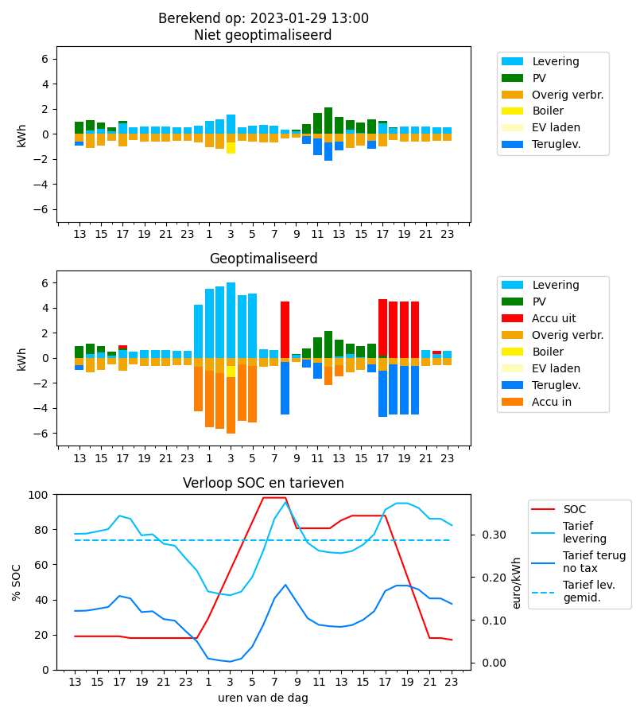

# DAY AHEAD

## Inleiding
Het programma Day Ahead voert de volgende acties, berekeningen en bewerkingen uit:

* ophalen dynamische energie tarieven bij Entsoe en/of NordPool
* ophalen van je verbruiksgevens van de vorige dag(en) bij Tibber
* ophalen van meteogegevens bij Meteoserver
* berekenen van de optimale inzet van een aanwezige accu, wp-boiler en elektrische auto
---
## Optimalisering
De optimalisering van het verbruik gebeurt met behulp van een generiek wiskundig algoritme
met de naam "mixed-integer lineair programming". Meer daarover kun je lezen op de 
website die ook het algoritme en allerlei bijbehorende hulpmiddelen aanbiedt:
https://python-mip.com/

Deze implementatie berekent een optimale inzet van je accu, boiler en ev, waarbij wordt 
gestreefd naar minimalisering van je kosten. Daarvoor worden de volgende zaken berekend:
* uit de prognose van het weer (globale straling) per uur wordt een voorspelling berekend van de productie van je 
zonnepanelen
* met de tarieven van je dynamische leverancier (incl. opslag, belastingen en btw) worden per uur de kosten 
en opbrengsten van het verbruik cq teruglevering berekend
* m.b.v. de karakteristieken van je accu worden per uur het laad- cq ontlaadvermogen berekend
* wanneer moet je elektrische auto worden geladen

Dit resulteert (in de mip-module) in ca tweehonderd vergelijkingen met twee variabelen(onbekenden). 
Door minimalisering van de kosten kan met behulp van het algoritme de meest optimale setting van al deze 
variabelen worden berekend. Dit zijn:
* per uur verbruik en kosten op de inkoopmeter
* per uur teruglevering en opbrengst op de inkoopmeter
* per uur laad- cq ontlaadvermogen van de accu en de SOC aan het einde van het uur
* tijdstip waarop de boiler moet worden opgewarmd
* uurvakken waarin de elektrische auto moet worden geladen

Het geheel kan grafisch worden weergegeven:

Of in tabelvorm:
         uur  accu_in  accu_out     soc  verbr   prod prod_n  basis   boil     ev     pv  kos_v  kos_p  k_p_n  b_temp
                  kWh       kWh       %    kWh    kWh    kWh    kWh    kWh    kWh    kWh    eur    eur    eur      oC
0      13.00     0.00      0.00   19.00   0.00   0.36   0.00   0.59   0.00   0.00   0.95   0.00  -0.11  -0.00   46.50
1      14.00     0.00      0.00   19.00   0.30   0.00   0.00   1.13   0.00   0.00   0.83   0.09  -0.00  -0.00   46.10
2      15.00     0.00      0.00   19.00   0.42   0.00   0.00   0.93   0.00   0.00   0.51   0.13  -0.00  -0.00   45.70
3      16.00     0.00      0.00   19.00   0.21   0.00   0.00   0.53   0.00   0.00   0.32   0.06  -0.00  -0.00   45.30
4      17.00     0.00      0.26   18.00   0.61   0.00   0.00   1.02   0.00   0.00   0.15   0.21  -0.00  -0.00   44.90
5      18.00     0.00      0.00   18.00   0.51   0.00   0.00   0.51   0.00   0.00   0.00   0.17  -0.00  -0.00   44.50
6      19.00     0.00      0.00   18.00   0.62   0.00   0.00   0.62   0.00   0.00   0.00   0.18  -0.00  -0.00   44.10
7      20.00     0.00      0.00   18.00   0.62   0.00   0.00   0.62   0.00   0.00   0.00   0.19  -0.00  -0.00   43.70
8      21.00     0.00      0.00   18.00   0.62   0.00   0.00   0.62   0.00   0.00   0.00   0.17  -0.00  -0.00   43.30
9      22.00     0.00      0.00   18.00   0.55   0.00   0.00   0.55   0.00   0.00   0.00   0.15  -0.00  -0.00   42.90
10     23.00     0.00      0.00   18.00   0.55   0.00   0.00   0.55   0.00   0.00   0.00   0.13  -0.00  -0.00   42.50
11      0.00     3.57      0.00   28.95   4.25   0.00   0.00   0.68   0.00   0.00   0.00   0.91  -0.00  -0.00   42.10
12      1.00     4.50      0.00   42.76   5.53   0.00   0.00   1.03   0.00   0.00   0.00   0.92  -0.00  -0.00   41.70
13      2.00     4.50      0.00   56.57   5.68   0.00   0.00   1.18   0.00   0.00   0.00   0.91  -0.00  -0.00   41.30
14      3.00     4.50      0.00   70.38   6.05   0.00   0.00   0.65   0.90   0.00   0.00   0.95  -0.00  -0.00   52.56
15      4.00     4.50      0.00   84.19   5.04   0.00   0.00   0.54   0.00   0.00   0.00   0.84  -0.00  -0.00   52.16
16      5.00     4.50      0.00   98.00   5.13   0.00   0.00   0.63   0.00   0.00   0.00   1.03  -0.00  -0.00   51.76
17      6.00     0.00      0.00   98.00   0.70   0.00   0.00   0.70   0.00   0.00   0.00   0.18  -0.00  -0.00   51.36
18      7.00     0.00      0.00   98.00   0.65   0.00   0.00   0.65   0.00   0.00   0.00   0.22  -0.00  -0.00   50.96
19      8.00     0.00      4.50   80.56   0.00   4.16   0.00   0.34   0.00   0.00   0.00   0.00  -1.55  -0.00   50.56
20      9.00     0.00      0.00   80.56   0.24   0.00   0.00   0.31   0.00   0.00   0.07   0.08  -0.00  -0.00   50.16
21     10.00     0.00      0.00   80.56   0.00   0.61   0.00   0.16   0.00   0.00   0.77   0.00  -0.17  -0.00   49.76
22     11.00     0.00      0.00   80.56   0.00   1.29   0.00   0.38   0.00   0.00   1.67   0.00  -0.34  -0.00   49.36
23     12.00     1.46      0.00   85.04   0.00   0.00   0.00   0.69   0.00   0.00   2.15   0.00  -0.00  -0.00   48.96
24     13.00     0.88      0.00   87.74   0.14   0.00   0.00   0.59   0.00   0.00   1.33   0.03  -0.00  -0.00   48.56
25     14.00     0.00      0.00   87.74   0.32   0.00   0.00   1.13   0.00   0.00   0.81   0.08  -0.00  -0.00   48.16
26     15.00     0.00      0.00   87.74   0.07   0.00   0.00   0.93   0.00   0.00   0.86   0.02  -0.00  -0.00   47.76
27     16.00     0.00      0.00   87.74   0.00   0.63   0.00   0.53   0.00   0.00   1.16   0.00  -0.19  -0.00   47.36
28     17.00     0.00      4.50   70.31   0.00   3.66   0.00   1.02   0.00   0.00   0.18   0.00  -1.30  -0.00   46.96
29     18.00     0.00      4.50   52.87   0.00   4.01   0.00   0.51   0.00   0.00   0.01   0.00  -1.48  -0.00   46.56
30     19.00     0.00      4.50   35.44   0.00   3.88   0.00   0.62   0.00   0.00   0.00   0.00  -1.44  -0.00   46.16
31     20.00     0.00      4.50   18.00   0.00   3.88   0.00   0.62   0.00   0.00   0.00   0.00  -1.39  -0.00   45.76
32     21.00     0.00      0.00   18.00   0.62   0.00   0.00   0.62   0.00   0.00   0.00   0.21  -0.00  -0.00   45.36
33     22.00     0.00      0.26   17.00   0.29   0.00   0.00   0.55   0.00   0.00   0.00   0.10  -0.00  -0.00   44.96
34     23.00     0.00      0.00   17.00   0.55   0.00   0.00   0.55   0.00   0.00   0.00   0.18  -0.00  -0.00   44.56
---
## Vereisten
Het programma day_ahead.py is een python-programma dat alleen draait onder python versie 3.8 of hoger.  
Het programma draait alleen als de volgende modules zijn geïnstalleerd met pip3.  
Je installeert de benodigde modules als volgt: 
`pip3 install mip pandas entsoe-py mysql-connector hassapi matplotlib nordpool`
  

Het programma veronderstelt de volgende zaken aanwezig/bereikbaar:

**Home Assistant** actueel bijgewerkte laatste versie

**MariaDB** (best geïnstalleerd als addon van HA), waar ook HA gebruik van maakt  

**phpMyAdmin** (best geïnstalleerd als addon van HA), met toegang tot de MariaDB server  

**database "day_ahead"** een aparte database in MariaDB voor dit programma met daarin:  
	
* een user die alle rechten heeft (niet root) 
* tabel **variabel**: 
  * Deze maak je met de query:  
    CREATE TABLE \`variabel\` (  
     \`id\` INT(10) UNSIGNED NOT NULL AUTO_INCREMENT,  
     \`code\` CHAR(10) NOT NULL DEFAULT '' COLLATE 'utf8mb4_general_ci', 
     \`name\` CHAR(50) NOT NULL DEFAULT '' COLLATE 'utf8mb4_general_ci', 
     \`dim\` CHAR(10) NOT NULL DEFAULT '' COLLATE 'utf8mb4_general_ci', 
      PRIMARY KEY (\`id\`) USING BTREE, UNIQUE INDEX \`code\` (\`code\`) USING BTREE, 
      UNIQUE INDEX \`name\` (\`name\`) USING BTREE ) COLLATE='utf8mb4_unicode_ci'  
      ENGINE=InnoDB  
      AUTO_INCREMENT=1;
  * Query voor het vullen van de inhoud van tabel "variabel"  
   INSERT INTO \`variabel\` (\`id\`, \`code\`, \`name\`, \`dim\`) VALUES (1, 'cons', 'consumed', 'kWh');  
   INSERT INTO \`variabel\` (\`id\`, \`code\`, \`name\`, \`dim\`) VALUES (2, 'prod', 'produced', 'kWh');  
   INSERT INTO \`variabel\` (\`id\`, \`code\`, \`name\`, \`dim\`)VALUES (3, 'da', 'price', 'euro/kWh');  
   INSERT INTO \`variabel\` (\`id\`, \`code\`, \`name\`, \`dim\`) VALUES (4, 'gr', 'globale straling', 'J/cm2');  
   INSERT INTO \`variabel\` (\`id\`, \`code\`, \`name\`, \`dim\`) VALUES (5, 'temp', 'temperatuur', '°C');  
   INSERT INTO \`variabel\` (\`id\`, \`code\`, \`name\`, \`dim\`) VALUES (6, 'solar_rad', 'PV radiation', 'J/cm2');  
 * tabel **values**: 
   * Deze maak je aan met de volgende query:  
    CREATE TABLE \`values\` ( 
    \`id\` BIGINT(20) UNSIGNED NOT NULL  AUTO_INCREMENT, 
    \`variabel\` INT(10) UNSIGNED NOT NULL DEFAULT '0',  
    \`time\` BIGINT(20) UNSIGNED NOT NULL DEFAULT '0',  
    \`value\` FLOAT NULL DEFAULT NULL,  
    PRIMARY KEY (\`id\`) USING BTREE,  
    UNIQUE INDEX \`variabel_time\` (\`variabel\`, \`time\`) USING BTREE,  
    INDEX \`variabel\` (\`variabel\`) USING BTREE,  
    INDEX \`time\` (\`time\`) USING BTREE ) COLLATE='utf8mb4_unicode_ci'  
    ENGINE=InnoDB  
    AUTO_INCREMENT=1`; 
   * De inhoud van values bouw je zelf op met het ophalen van de diverse gegevens  
---
## Programma starten
Je kunt het programma draaien en testen via een terminalvenster op je laptop/pc:   
	`python3 day_ahead.py [parameters]`  
  
Start je het programma zonder parameters dan worden de databases "geopend" en dan wacht het programma tot een opdracht uit  de takenplannen (zie hieronder) moet worden uitgevoerd.   
De volgende parameters kunnen worden gebruikt:  
*   **debug**  
  alleen van toepassing in combinatie met het onderdeel "calc" (zie hierna), voert wel de berekening uit maar zet de berekende resultaten niet door naar de apparaten  
*   **prices**  
  haalt de day ahead prijzen op nordpool en/of entsoe  
*    **tibber**  
  haalt de verbruiks- en productiegegevens op bij tibber  
*    **calc**  
  voert de "optimaliseringsberekening" uit:  
haalt alle data (prijzen, meteo) op uit de database  
berekent de optimale inzet van de accu, boiler en ev  
berekent de besparing tov een reguliere leverancier berekent de besparing zonder optimalisering met alleen day ahead presenteert een tabel met alle geprognoticeerde uurdata presenteert een grafiek met alle geprognoticeerde uurdata*     scheduler:  
 hiermee komt het programma in een loop en checkt iedere minuut of er een taak moet worden uitgevoerd  
---
### Instellingen  
  
 Het bestand options.json bevat alle instellingen voor het programma day_ahead.py. 
Opmerking: alle instellingen die beginnen met "!secret" staan komen in het bestand `secrets.json`te staan  met de key die hier achter !secret staat  
**homeassitant**
 * url : de url waar de api van je home assistant bereikbaar is  
 * token: om de api te kunnen aanroepen is er  een token nodig.  
               Deze kun je genereren in je Home Assistant website

**entsoe-api-key**  
	Deze key genereer je op de site van entsoe en heb je nodig om daar de energieprijzen van de volgende op te halen.
    Je genereert deze key (token) als volgt: 
 * Website: https://transparency.entsoe.eu      
 * Registreer je als   gebruiker 
 * Klik op "My Account Settings"  
 *  Klik op "Generate a new token"

**database da**:  de database voor het day ahead programma  
 * server: ip adres van de server (waar mariadb draait)  
 * database: naam van de database  
 * port: poort op de server (meestal 3306)  
 * username: user name  
 * password: wachtwoord

**database ha**: de database van Home Assistant  
 * server: ip adres van de server (waar mariadb draait)  
 * database: naam van de database  
 * port: poort op de server (meestal 3306)  
 * username: user name  
 * password: wachtwoord
 
**meteoserver-key**: de meteodata worden opgehaald bij meteoserver  
    ook hiervoor heb je een key nodig . Je genereert deze key (token) als volgt: 
 * website: https://meteoserver.nl/login.php 
 * registreer je als gebruiker 
 * daarna klik je op Account, tabje "API Beheer" en je ziet je key staan
Opmerking: je kunt gratis maximaal 500 dataverzoeken per maand doen, we doen er maar 4 per dag = max 124 per maand

**prices**  

 * regular high: het hoge tarief van een "reguliere" oude leverancier,
   ex btw, kaal, euro per kWh
 * regular low: idem het "lage" tarief, ex btw, kaal , euro per kWh
     switch to low: tijdstop waarop je omschakelt naar "laag tarief" (meestal 23 uur)
  * energy taxes delivery: energiebelasting oplevering ex btw, euro per kWh  
           2022 : 0.06729,  
           2023 : 0.12599  
   * energy taxes redelivery: energiebelasting op teruglevering ex btw, euro per kWh  
           2022: 0.06729,  
           2023: 0.12599  
    * cost supplier delivery : opslag leverancier euro per kWh, ex btw  
     * cost supplier redelivery:  opslag leverancier voor teruglevering per kWh, ex btw  
      * vat:    btw in %  
         "2022": 9,  
         "2023": 21  
      * last invoice:  datum laatste jaarfactuur en/of de begindatum van je contractjaar
     * tax refund: kun je alles salderen of is je teruglevering hoger dan je verbruik  ( True of False) 

**boiler**  instellingen voor optimalisering van het elektraverbruik van je warmwater boiler
   * entity actual temp. : entiteit in ha die de actuele boilertemp. presenteert  
   * entity setpoint: entiteit die de ingestelde boilertemp. presenteert  
   * entity hysterese: entiteit die de gehanteerde hysterese voor de boiler presenteert  
   * cop: cop van de boiler  bijv 3: met 1 kWh elektriciteit wordt 3 kWh warm water gemaakt (een elektrische boiler heeft een cop = 1)
   * cooling rate: gemiddelde afkoelsnelheid van de boiler in K/uur  
   * volume: inhoud van de boiler in liter  
   * heating allowed below: temperatuurgrens in °C  waaronder de boiler mag worden opgewarmd  
   * elec. power: elektrisch vermogen van de boiler in W  
   * activate entity: entiteit (meestal van een inputhelper) waarmee de boiler opwarmen wordt gestart  
   * activate service: naam van de service van deze entiteit  

**heating**:  dit onderdeel is nog in ontwikkeling  
   * entity adjust heating curve: entiteit waarmee de stooklijn kan worden verschoven  
   * adjustment factor: 

**battery**: de gegevens en de instellingen van de accu
   * entity actual level: entiteit die de actuele soc van de accu presenteert  
   * capacity: capaciteit van de accu in kWh  
   * lower limit: onderste soc limiet (tijdelijk)  
   * upper limit: bovenste soc limiet  
   * optimal lower level: onderste soc limiet voor langere tijd  
   * max charge power: maximaal laad vermogen in kW  
   * max discharge power: maximaal ontlaadvermogen in kW  
   * minimum power: minimaal laad/ontlaadvermogen  
   * charge efficiency: efficientie van het laden (factor van 1)  
   * discharge efficiency : efficientie van het ontladen (factor van 1)  
   * cycle cost : afschrijfkosten (in euro) van het laden of ontladen van 1 kWh  
   * entity set power feedin": entiteit waarje het te laden / ontladen vermogen inzet  
   * entity set operating mode": entiteit waarmee je het ess aan/uit zet  
   * entity stop victron": entiteit waarmee je datum/tijd opgeeft wanneer het ess moet stoppen  
   * entity balance switch": entiteit waarmee je de victron op "balanceren" zet  
 
**solar** de data van je zonnepanelen.
   * tilt : de helling van de panelen in graden; 0 is vlak, 90 is verticaal  
   * orientation : orientatie in graden, 0 = zuid, -90 is oost, 90 west  
   * capacity: capaciteit in kWp  
   * yield: opbrengstfactor van je panelen als er 1 J/cm2 straling op je panelen valt in kWh/J/cm2  
 
**electric vehicle** dit is voorlopig gebaseerd op een Volkswagen auto die kan worden bereikt met WeConnect . Andere  auto's graag in overleg toevoegen.
   * capacity: capaciteit accu in kWh,  
   * entity position: entiteit die aangeeft of de auto "thuis" (home) is  
   * entity max amperage: entiteit die het max aantal amperes aangeeft waarmee kan worden geladen  
   * entity actual level: entiteit die aangeeft hoe ver de auto is geladen (in %)  
   * entity plugged in: entiteit die aangeeft of de auto is ingeplugged  
   * charge scheduler: oplaad scheduler  
   * entity set level: entiteit van een input help die aangeeft tot welk niveau moet worden geladen in %  
   * entity ready time: entiteit van een input tijd hoe laat de auto op het gewenste niveau moet zijn  
   * charge switch:  entiteit waarmee het laden aan/uit kan worden gezet 

 **tibber** 
 * api url" : url van de api van tibber  
 * api_token" : het token van de api van tibber  
  Deze vraag je als volgt op:  
   * log in met je account op https://developer.tibber.com/explorer  
   * de token staat boven onder de balk  
 
 **scheduler** taken planner. 
 Het programma maakt gebruik van een eenvoudige takenplanner.  
 De volgende taken kunnen worden gepland:
   * get_meteo_data: ophalen van meteo gegevens bij meteoserver  
   * get_tibber_data: ophalen van verbruiks- en productiegegevens per uur bij tibber  
   * get_day_ahead_prices: ophalen van day ahead prijzen bij nordpool cq entsoe  
   * calc_optimum: bereken de inzet accu, boiler en auto voor de komende uren,  
            de inzet van het lopende uur wordt doorgezet naar de betreffende apparaten (tenzij het programma is 
          gestart met de parameter debug) 

De key heeft het formaat van "uumm": uu is het uur, mm is de minuut  
de uren en minuten zijn ofwel een twee cijferig getal of XX  
ingeval van XX zal de taak ieder uur cq iedere minuut worden uitgevoerd. 
Bijvoorbeeld :  `"0955": "get_meteo_data"`: de meteodata worden opgehaald om 9 uur 55 
`"xx00": "calc_optimum"`: ieder uur exact om "00" wordt de optimaliseringsberekening uitgevoerd.