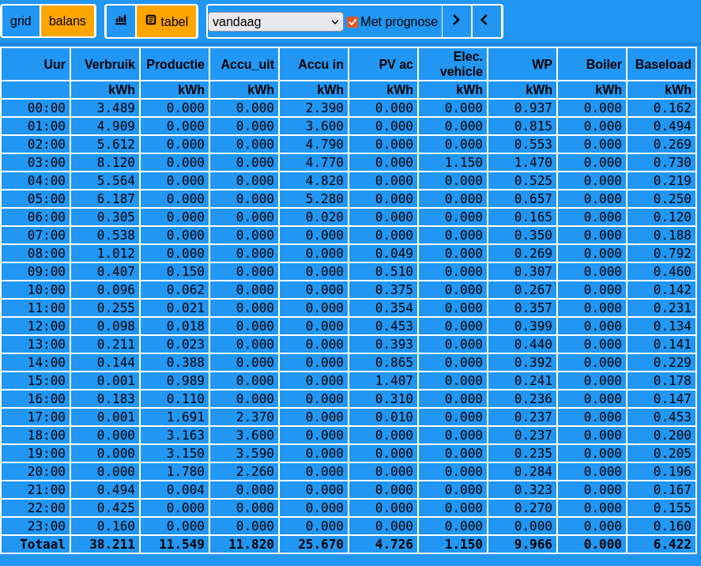
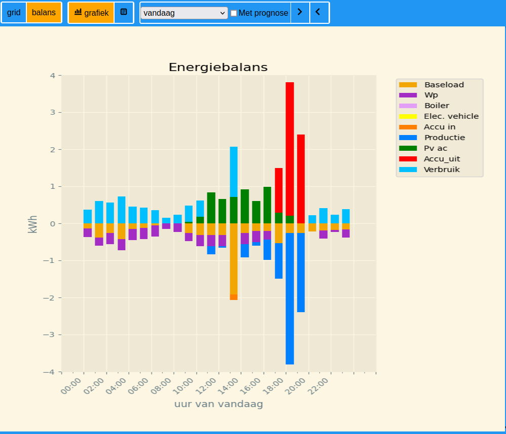

# Changelog 刀 DAO
# Day Ahead Optimization

## [V2024.2.1]
In deze versie zijn veel zaken toegevoegd en gewijzigd:
- We stappen over op eenzelfde soort **versienummering** als Home Assistant: jaar, maand en opvolgende nummering binnen die maand.
- Voor de rapportages is het niet meer verplicht om de data op te halen bij **Tibber**.
Je kunt dus ook klant zijn bij een andere leverancier (bijv ANWB). Je haalt dus alle aanroepen voor het ophalen 
van data bij Tibber (`get_tibber_data`) uit de scheduler. In dat geval kan ook het invullen van de url en het token
bij Tibber in de instellingen achterwege blijven. <br>
Om toch goede rapportages te kunnen maken is het dan wel noodzakelijk dat je je verbruiksgegevens van de slimme 
meter bijhoudt in Home Assistant (via de instellingen van het Energiedashboard van HA) en de entiteiten waarmee je deze 
bijhoudt moet je opgeven bij de sectie **report** van de instellingen (zie ook DOCS.md).
- Voor het **opladen van je elektrische auto('s)** kun je nu een lijst met amperages opgeven (eventueel aangevuld met efficiency)
waaruit het programma de voor jouw gunstigste amperages kiest gegeven de prijs van elektriciteit, de capaciteit van je aansluiting
en het tijdstip waarop de auto het jouw gewenste laadniveau moet hebben (zie ook DOCS.md).<br>
**breaking change** Naast de instellingen voor de verschillende laadniveaus moet je nu ook een entiteit ("entity set charging ampere", input_number) opgeven,
waarin het programma de gewenste hoeveelheid ampere kan doorgeven waarmee in het lopende uur geladen moet worden.<br>
De instelling "charge switch" komt te vervallen.
- Het invoeren je **baseload** bij je instellingen kan vervallen als het programma jouw baseload kan berekenen uit opgeslagen 
  verbruiken over een voldoende lange periode. <br>
  Daarvoor moet je over minimaal twee maanden de volgende gegevens bijhouden in Home Assistant (via de instellingen van het energiedashboard):
    - de verbruiksgegevens van de slimme meter
    - indien van toepassing het verbruik voor het opladen van je elektrische auto('s)
    - de in- en uitgaande elektriciteit naar en van je thuisbatterij(en)
    - indien van toepassing het verbruik van je wp
    - indien van toepassing het verbruik van je boiler
    - de productie van je zonnepanelen<br>
  
    Bij de instellingen (zie DOCS.md) geef je dan op dat de baseload moet worden berekend en 
  hoeveel dagen terug daarvoor moet worden gerekend. <br>
 **Bonus**: de baseload wordt per weekdag berekend. Met name in het weekend wijkt de baseload af van het 
weekgemiddelde en de verwachting is dat dit de nauwkeurigheid van de voorspellingen ten goede komt.
- Bij een flink aantal instellingen zijn "**default**" (standaard) instellingen geintroduceerd. Dat betekent dat 
je deze instellingen kunt weglaten in het instellingen bestand als de standaard instelling voor jou voldoet.
Belangrijkste instelling die weggelaten kan worden als je het programma als addon op je HomeAssistant-machine
installeert zijn de instellingen voor de communicatiemet Home Assistant. Dit regelt dan de Home Assistant 
supervisor voor je. In DOC.md is een tabel opgenomen van alle instellingen inclusief de default-instelling (voor zover van toepassing)
- De rapportage functie is uitgebreid met een rapportage van je **energiebalans**:


Om dat goed te laten werken zul je in Home Assistant (net als voor het berekenen van de baseload) alle verbruiksgegevens
van diverse meters en verbruikers moeten bijhouden(zie voor verdere uitleg DOCS.md)
- Na een berekening is kreeg je al een hele uitdraai van allerlei berekeningen.
Met name de tabel met de in- en uitgaande energie en de efficiency van je thuisbatterij(en) riep hier en daar wat vragen op.
Deze tabel is nu aangepast (de berekeningen zijn hetzelfde):
```   
   In- en uitgaande energie per uur batterij: Accu1
   
   uur   ac->    eff   ->dc pv->dc   dc->    eff  ->bat  o_eff    SoC
          kWh      %    kWh    kWh    kWh      %    kWh      %      %
    15   0.00     --   0.00   0.00   0.00     --   0.00     --  43.50
    16   0.00     --   0.00   0.00   0.00     --   0.00     --  43.50
    17  -1.20  95.50  -1.26   0.00  -1.26  98.00  -1.28  93.59  39.23
    18  -3.60  93.40  -3.85   0.00  -3.85  98.00  -3.93  91.53  26.12
    19  -2.26  94.90  -2.39   0.00  -2.39  98.00  -2.43  93.00  18.00
    20   0.00     --   0.00   0.00   0.00     --   0.00     --  18.00
    21   0.00     --   0.00   0.00   0.00     --   0.00     --  18.00
    22   0.00     --   0.00   0.00   0.00     --   0.00     --  18.00
    23   0.00     --   0.00   0.00   0.00     --   0.00     --  18.00
Totaal  -7.06     --  -7.50   0.00  -7.50     --  -7.65     --       
```
## [Unreleased]
De volgende zaken staan nog op de todo lijst:
- Alle uitvoer omzetten naar logger 
- dashboard afmaken

## [V0.4.73]
In deze versie zijn de volgende zaken gewijzigd:
- fout bij niet melden van datum/tijd van notificatie opgelost
- op een aantal punten is de documentatie verhelderd
- optioneel: <br>
  - het basisverbruik (baseload) kan berekend worden uit de geschiedenis (zie DOCS.md)
  - voor het goed kunnen berekenen van de dient een lijst met sensoren ingevuld te worden 
    het verbruik/productie van inkoop, maar ook van de batterij(en) en 
    de stuurbare verbruikers/producenten registreren.

## [V0.4.72]
- apparmor is geimplementeerd
- er is icon toegevoegd voor de zijbalk 

## [V0.4.70]
- apparmor is (gedeeltelijk) geactiveerd
- het creeeren van de tables en de benodigde inhoud in de database wordt 
na installatie of update van de addon door de software uitgevoerd

## [V0.4.61]
- kleuren DOCS.md staan nu goed
- addon kan ook voor niet-admin gebruikers in zijbalk worden geplaatst
- notificatie datum/tijd moet nu werken
- in titels wordt nu alleen nog maar "Optimization" gebruik

## [V0.4.57] 2024-01-20
### Added
- Ingress is toegevoegd aan de presentatie van de addon via het dashboard ("toon zijbalk")
### Changed
- README.md is gesplitst:
  - een korte inleiding in het programma (heet nog steeds README.md)
  - een uitgebreide handleiding (DOCS.md) die ook benaderd kan worden via "documentatie" vanuit de addon

## [V0.4.56] 2024-01-14
### Changed
Addon is met volledige ondersteuning voor 64 bit Intel/AMD Processor

## [v0.4.5] - 2024-01-09

### Changed

Het programma is ondergebracht in een addon van Home Assistant.<br>
Ten behoeve van de addon is alle software geplaatst onder de directory "dao". <br>
Alle documentatie is verplaatst naar docs\MANUAL.md

De volgende update query moet in de database "day_ahead" worden doorgevoerd:
````
UPDATE `day_ahead`.`variabel` SET `code`='pv_ac', `name`='Zonne energie AC' WHERE  `id`=15;
````
### Added
De volgende variabelen worden toegevoegd aan het bestand `variabel`:
````commandline
   INSERT INTO `variabel` (`id`, `code`, `name`, `dim`) VALUES (17, 'pv_dc', 'Zonne energie DC', 'kWh');
````
In options.json kun je nu het maximale vermogen opgeven van je netwerk aansluiting.
Zie DOCS.md

##[v0.4.0] - 2023-10-15

### Removed
De functionaliteit om via de websocket in HA een berekening te starten is verwijderd.
Dat kan nu via een rest-command: /api/run


## [v0.3.1] - 2023-09-12

### Added
- je kunt nu de grafische stijl definieren o.a. darkmode. (zie DOCS.md, graphics) 
- je kunt het presenteren van de grafieken na het uitvoeren van een berekening aan/uit zetten. (zie DOCS.md, graphics)
- de volgende aanvullende python modules moeten worden geinstalleerd:
````
  pip3 install gunicorn ephem
````
- het protocol voor de api en de ws richting Home Assistant is instelbaar (zie in DOCS.md, bij het onderdeel "Home Assistant") 
- voor de ondersteuning van een API moeten berekende resultaten worden opgeslagen.
Daarvoor moeten de volgende variabelen worden toegevoegd aan het bestand `variabel`:
````
INSERT INTO `variabel` (`id`, `code`, `name`, `dim`) VALUES (9, 'bat_in', 'Batterij in', 'kWh');
INSERT INTO `variabel` (`id`, `code`, `name`, `dim`) VALUES (10, 'bat_out', 'Batterij uit', 'kWh');
INSERT INTO `variabel` (`id`, `code`, `name`, `dim`) VALUES (11, 'base', 'Basislast', 'kWh');
INSERT INTO `variabel` (`id`, `code`, `name`, `dim`) VALUES (12, 'boil', 'Boiler', 'kWh');
INSERT INTO `variabel` (`id`, `code`, `name`, `dim`) VALUES (13, 'wp', 'Warmtepomp', 'kWh');
INSERT INTO `variabel` (`id`, `code`, `name`, `dim`) VALUES (14, 'ev', 'Elektrische auto', 'kWh');
INSERT INTO `variabel` (`id`, `code`, `name`, `dim`) VALUES (15, 'pv', 'Zonnenergie', 'kWh');
INSERT INTO `variabel` (`id`, `code`, `name`, `dim`) VALUES (16, 'soc', 'SoC', '%');
````
Enkele rijen in de tabel `variabel` moeten worden geupdated: <br>
````
UPDATE `day_ahead`.`variabel` SET `name`='Verbruik' WHERE  `code`='cons';
UPDATE `day_ahead`.`variabel` SET `name`='Productie' WHERE  `code`='prod';
UPDATE `day_ahead`.`variabel` SET `name`='Tarief' WHERE  `code`='da';
UPDATE `day_ahead`.`variabel` SET `name`='Globale straling' WHERE  `code`='gr';
UPDATE `day_ahead`.`variabel` SET `name`='Temperatuur' WHERE  `code`='temp';
````
En er moet een extra tabel `prognoses` worden aangemaakt:
````
CREATE TABLE `prognoses` (
	`id` BIGINT(20) UNSIGNED NOT NULL AUTO_INCREMENT,
	`variabel` INT(10) UNSIGNED NOT NULL DEFAULT '0',
	`time` BIGINT(20) UNSIGNED NOT NULL DEFAULT '0',
	`value` FLOAT NULL DEFAULT NULL,
	PRIMARY KEY (`id`) USING BTREE,
	UNIQUE INDEX `variabel_time` (`variabel`, `time`) USING BTREE,
	INDEX `variabel` (`variabel`) USING BTREE,
	INDEX `time` (`time`) USING BTREE
)
COLLATE='utf8mb4_unicode_ci'
ENGINE=InnoDB
AUTO_INCREMENT=1;
````
- de webserver/dashboard is uitgebreid met de volgende functionaliteit:
  * je kunt met een api-call gegevens opvragen die je o.a. kunt gebruiken in Home Assistant 
  om sensoren te voorzien van data en attributen en waar je met de apexcharts-card 
  grafieken kunt maken (zie DOCS.md)
  * je kunt met een api call een berekening of bewerking uitvoeren. Deze nieuwe functionaliteit zal de
  websocket interface vervangen.
  * de "reports" zijn uitgebreid met meer perioden en bij de perioden waar ook de prognose die van toepassing zijn
  van toepassing is kun je "prognose" aan/uit zetten (zie DOCS.md)
  * je kunt met de web-interface alle berekeningen en bewerkingen uitvoeren en je krijgt direct 
  de logging van het resultaat te zien (zie DOCS.md) 

### Fixed
- Het laatste uur (meestal uur 23:00) wordt nu bij de grafieken volledig getoond. Dat geldt ook voor de SoC waarde die om 24:00 uur wordt bereikt.
- Grafieken worden niet meer getoond in de schedule-modus zodat het programma daar niet op blijft hangen
- De pv-productie werd niet goed berekend voor panelen die niet op zuid waren georienteerd.
Dit is aangepast.
- Het tarief voor teruglevering zonder belasting wordt nu berekend zonder de saldering van de 
inkoopvergoeding van de leverancier.
- Bij een tussentijdse berekening (dus niet op het hele uur) werd de boiler te snel ingezet.
Dit is hersteld.

### Changed
- het laden van de batterij (van omvormer naar dc) wordt nu berekend met een zogenaamde "special ordered set"(sos). 
Dit heeft twee voordelen: <br>
  - het rekent veel sneller
  - er wordt makkelijker tussen twee "stages" geinterpoleerd. <br>
  Als dit goed bevalt zal het ook worden geimplementeerd voor het ontladen (van dc naar ac) en van dc naar batterij en vice versa.<br>
- de prijzengrafieken zijn in blokvorm en uitgelijnd met de verbruiksgrafieken


### Issues
Als het programma draait in scheduler-mode wordt een websocket geopend naar HA zodat vanuit HA een 
optimaliseringsberekening kan worden gestart.
Als HA stopt (bijv. voor een update) dan blijft de websocket "in de lucht" maar is niet meer effectief.

### Removed


### Deprecated

- geen

### Security

- geen

## [v0.3.0] - 2023-08-18

### Added

- de staafjes van de staafgrafieken worden links aan het uurtijdstip uitgelijnd
- de grafieklijnen van de prijzen zijn nu stapsgewijs
- via de optie **graphics** kun je kiezen welke prijzen moeten worden getoond in de grafiek met prijzen (zie README)
- als je een berekening laat uitvoeren met de parameter **debug** krijg je nu meer info welke instellingen zouden zijn 
aangepast als je de berekening zonder **debug** zou hebben laten uitvoeren
- de webserver /het dasboard kan gedeeltelijk worden gebruikt (zie README)
- een input_datetime entity die wordt geupdate als door het programma een taak wordt uitgevoerd.
- een logger is toegevoegd aan de webserver (wordt straks dashboard). <br>
De loggings zijn te vinden in data\log\dashboard.log.
- versienummer in bestand _version.py
- check op voldoende aantal rijen bij prognose data (dynamische prijzen en meteo)
    - bij 2 rijen of minder wordt er niet gerekend<br>
    - bij 3 tot 8 rijen wordt er wel gerekend maar wordt er wel een waarschuwing afgegeven 
    
- een changelog
- naar keuze datum-tijd of alleen tijd input helper voor aangeven wanneer een elektrische auto geladen moet zijn

### Fixed

- Tijdens een lopend uur (dus met een eerste uur wat minder dan 60 minuten duurt)
gaf het programma verkeerde resultaten voor dat eerste uur. Dit is gefixed.
- ws parameter overal omgezet naar self.w_socket
- naar keuze datum-tijd of alleen tijd input helper voor aangeven wanneer een elektrische auto geladen moet zijn

### Changed
    
- laden auto wordt alleen uitgezet als auto thuis is (en aangesloten) 
- ongebruikte instellingen uit DOCS.md gehaald
- navigatieknoppen in webserver bij "home" omgezet
- menu optie **Meteo** in webserver voorzien van toelichting "in ontwikkeling"
- notificatie via Home Assistant toegevoegd. Zie voor meer informatie DOCS.md bij **notification entity**
- in het instellingenbestand options.json is de naam van de entity aanduiding veranderd: <br>
`"entity ready time"` wordt `"entity ready datetime"`
- aanvullingen en wijzigingen in DOCS.md


### Issues
Als het programma draait in scheduler-mode wordt een websocket geopend naar HA zodat vanuit HA een 
optimaliserings berekening kan worden gestart.
Als HA stopt (bijv voor een update) dan blijft de websocket "in de lucht" maar is niet meer effectief.

### Removed

- prog/da_webserver.py verwijderd

### Deprecated

- geen

### Security

- geen
