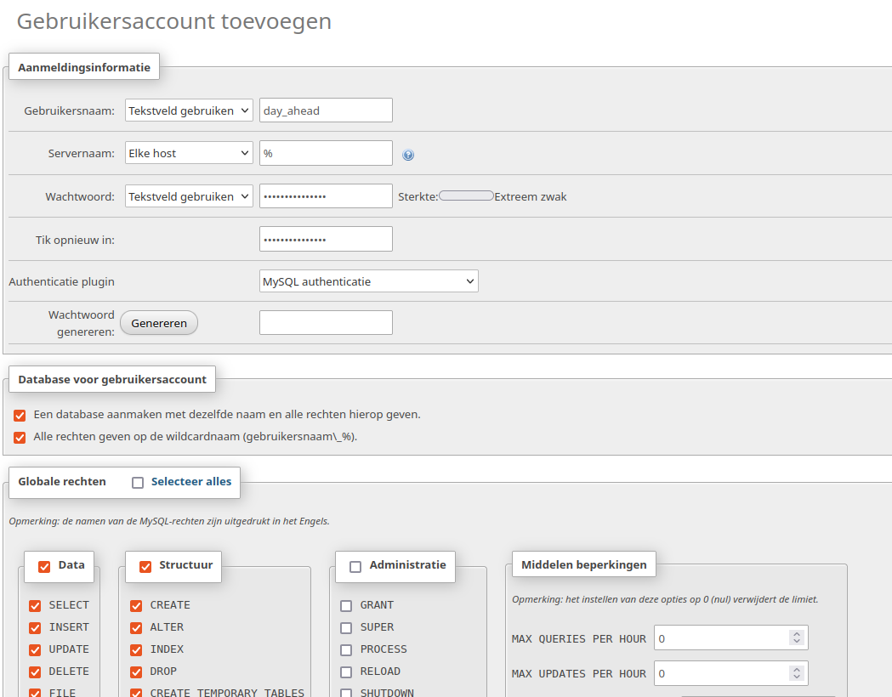

# **刀 Day Ahead Optimization**
# Installatie en instellingen<br>

## Inhoudsopgave  
[Vereisten](#Vereisten)<br>
[Installatie](#installatie)<br> 
[Dashboard](#dashboard) <br>
[Configuratie](#configuratie) <br>
[Api](#api) <br>
[Terminal](#terminal)


## Vereisten
Het programma day_ahead.py is een python-programma dat alleen draait onder python versie 3.10 of hoger. <br/>
De benodigde software en alle modules worden met het installeren van de addon geinstalleerd.

Het programma veronderstelt de volgende zaken aanwezig/bereikbaar:

### **Home Assistant**<br>
Actueel bijgewerkte laatste versie.

### **MariaDB**<br>
Best geïnstalleerd als addon van HA waar ook HA gebruik van maakt. Zet hierbij poort 3306 open door in de Add-on dit poortnummer in te vullen bij het onderdeel Netwerk. Indien het leeg blijft is de MariaDB database alleen bereikbaar voor HA.

### **phpMyAdmin**<br>
Best geïnstalleerd als addon van HA met toegang tot de MariaDB server.
Start de webui van phpMyAdmin maak je met een scherm zowel de user als de database 
voor het programma aan: <br>
  <br />
De gebruikersnaam mag je zelf kiezen, evenals het te gebruiken wachtwoord.
Maak van beide een aantekening want die gegevens moet je straks invullen bij de instellingen van het programma.
Voor de rechten vink je alles aan onder de kopjes "data" en "structuur".
Om mogelijke problemen te voorkomen geef je deze user GEEN toegang tot "Administratie".
Volgende stap: installeer de addon.

****************************************
*****************************************

## Installatie
De addon wordt geinstalleerd als een community addon voor Home Assistant.
Je installeert de addon als volgt:
In Home Assistant kies je in de zijbalk voor "Instellingen" (Settings), 
daarna voor de optie "Add-ons".
Je kiest met de knop rechtsonder voor "Add-on shop".
In het "drie puntjes menu" rechtsboven kies je voor "Repositories".
Dan krijg je een pop-up waarin je o.a Github repositories kunt toevoegen.
Vul daar  `https://github.com/corneel27/day-ahead/` in en klik op "Toevoegen" (Add).
Na ca 10 seconden staat de addon in de lijst en kun je de "Beheer de add-onrepositories" dialoog sluiten.
Als je nu je pagina ververst (met F5) staat de nieuw addon in het overzicht (onder de officiele addons).
Klik op de nieuwe addon en je krijgt het informatie-scherm te zien.

Klik op "Installeer" en wacht ca 5 minuten (deze tijd is afhankelijk van de snelheid van je processor).
Als de addon is geinstalleerd kun je klikken op "Toon in zijbalk", waardoor je makkelijk bij
het dashboard van de addon kunt komen.

Klik op de naam van de addon in de zijbalk en kies voor `"Config"\"Options"`
Vul bij "Homeassistant", "Database Homeassistant" en "Database Day Ahead" alle gegevens in.
De wachtwoorden en het token kun je invullen bij `"Config"\"Secrets"`
Je gaat nu weer terug naar het Informatiescherm van de addon en klik op "Herstarten",
zodat alle instellingen worden overgenomen.


---

## Dashboard

### Dashboard benaderen
Het programma wordt geleverd met een webserver die je als een dashboard kunt benaderen.
Dit onderdeel is nog in ontwikkeling, maar kan al wel worden gebruikt.

Na een succesvolle installatie van de addon zou de webserver in de lucht moeten zijn.<br>
Je benadert de webserver/het dashboard met een browser als volgt:<br>
  * ```http://<ip-adres>:<ip-poort>/```, waarbij je voor:<br />
  * ```<ip-adres>``` het ipadres invult van ja HA machine waarop ook de webserver draait<br>
  * ```<ip-poort``` het poortnummer invult waarop je de webserver kunt bereiken (zie verder).<br/>

Bijvoorbeeld : ```http://192.168.178.36:5000/```

De specifieke instellingen voor het dashboard staan ook in options.json onder de sleutel **dashboard**
Je kunt de volgende instellingen maken:
* port: dit is de poort op de server waarop je de webserver kunt benaderen.

### Dashboard menu
Het hoofdmenu van het dashboard bestaat uit 4 opties: <br />
   <br />

- Home
- Run
- Reports
- Config

**Home**<br/>
Deze webpagina komt ook naar voren als je de webservervia je browser benadert: <br />
   <br />
Daarin toont zich een submenu met daarin de informatie die je met submenu selecteert:
Het submenu geeft links de keuze de keuze uit (voorlopig twee **onderwerpen**):
 - grid (deze is nu actief, dat wordt aangegeven met de kleur rood)
 - accu1 (de naam van je accu), helaas werkt dit nog niet <br />

In het midden van het submenu kun je kiezen **hoe** je de gevraagde informatie wil zien:
 - grafiek (nu actief)
 - tabel <br />

Rechts kun je bladeren door de aangeboden informatie:
- **|<** de laatste aanwezige grafiek/tabel
- **<** de vorige
- **>** de volgende
- **>|** de eerste
-  met de afvalbak kun je de aangeboden informatie verwijderen

**Run**<br/>
 <br />
Via deze menu-optie kun je alle mogelijke berekeningen en bewerkingen van het programma activeren 
(zie ook het begin van deze handleiding). <br/>
Je activeert een bewerking door deze aan te klikken.<br/>
Je krijgt direct een bevestiging dat de betreffende berekening/bewerking wordt uitgevoerd.<br/>
Na 10 tot 15 seconden komt het log-bestand van de bewerking/berekening in beeld.
Wil je het grafische resultaat van een optimaliseringsberekening zien klik dan op "Home",
Je krijgt dan de laatste berekende grafiek in beeld.

**Reports**<br/>
 <br />
Dit onderdeel is nog in ontwikkeling, maar biedt nu al veel mogelijkheden.<br/>
Er is nog geen verschil tussen verbruik en kosten, omdat alles netjes in een tabel past.
Maar er komen nog wel verschillende verbruiks- en kostengrafieken.
Het grafische deel werkt nu nog basaal, maar wordt ook nog verder uitgewerkt.
In het pull-down menu kun je de periode kiezen waarvan je een rapport wil zien.
Je hebt de keuze uit de volgende perioden:
* vandaag _*_ <br/>
* vandaag en morgen (alleen zinvol na 13:00 uur) _*_ <br/>
* gisteren <br/>
* deze week _*_ <br/>
* vorige week <br/>
* deze maand _*_ <br/>
* vorige maand <br/>
* dit jaar _*_ <br/>
* vorig jaar <br/>
* dit contractjaar _*_ <br/>
* 365 dagen

De perioden met een _*_ hebben de optie "met prognose".
Als je die aanvinkt wordt een rapportage berekend inclusief de resultaten van de laatst uitgevoerde optimaliseringsberekening.
Dit geldt zowel voor de tabel als de grafiek. In de toekomst zullen in de grafiek de "prognose waarden" iets afwijkend worden getoond.

**Settings**<br/>
-    ***Options***<br/>
Hiermee kun je het instellingen bestand (options.json) bewerken
- ***Secrets***<br />
Hiermee bewerk je het bestand (secrets.json) met je wachtwoorden en andere zaken die je niet in options.json wil opnemen.

---

## Configuratie

Na de eerste installatie van de addon wordt er een bestand aangemaakt (gekopieerd van options_vb.json) met alle instellingen van het programma.
Het bestand `options.json` in de folder bevat alle instellingen voor het programma day_ahead.py en dien je zelf aan te maken. Het voorbeeld bestand `options_vb.json` kun je als basis gebruiken en dien je aan passen naar jouw omgeving en omstandigheden.<br>
Alle instellingen die beginnen met "!secret" staan komen in het bestand `secrets.json` te staan met de key die hier achter !secret staat.
Deze bestanden staan lokaal in de map `\config`, maar zijn externe benaderbaar met Samba,<br>
Er zijn twee manieren om bestanden aan te passen:
* als je de HA-addon Samba hebt geinstalleerd, krijg je met je bestandenbladeraar (bij Windows is dat de explorer, bij Mac finger) 
toegang tot de folder `/addon_configs/xxx_day_ahead_opt` op je Home Assistant machine. 
In de supmap `dao_data` staan de configuratie bestanden. Je kunt dan met je eigen teksteditor (bijv notepad) de bestanden aanpassen.<br>
 Let op gebruik geen Word of iets dergelijks, want die plaatsen opmaak codes in de tekst.<br>
* via het dashboard van de addon (als deze kan opstarten) kun je via de menu-opties `\Settings\options` en `\Settings\secrets`


Hieronder staat voor de verschillende onderdelen van options.json uitgelegd welke informatie dient te worden ingevuld.
Ga je hier voor de eerste keer mee aan gang volg dan de volgende aanpak:
* vul eerst de meest noodzakelijke informatie in: 
    * homeassistant
    * database da
    * database ha
    * meteoserver
    * prices
    * baseload (als je die niet weet neem de basload over van het voorbeeld) 
* zet de volgende instellingen op "standaard":
  * graphical backend: blanko ("")
  * graphics: default
  * strategy: minimize cost
  * notifications bij opstarten en berekening: false
  * grid, max_power: 17 kW (komt overeen met 3 x 25 A)
  * dashboard, port: 5000
* laat de rest "blanko" 
  * boiler, boiler present false
  * heating, heater present false
  * battery: leeg = "[]"
  * solar: leeg = "[]"
  * electric vehicle: leeg = "[]"
  * tibber nog niet invullen of wijzigen
  * scheduler: alles laten staan
* Kijk nu of de addon wil opstarten, kijk na ca 10 seconden naar de logging en probeer
in je browser het dashboard van de addon te bereiken: `http://<ipadres van homeassistant>:5000`
* Als dit allemaal werkt kun je een verbruiksonderdeel invullen waarmee het programma het verbruik kan "schuiven".
Als je dit hebt ingevuld laat dan het programma via het menu van het dashboard rekenen:<br> 
\Run\Optimaliseringsberekening met debug. Dit duurt een aantal seconden. Inspecteer het resultaat en pas
desgewenst je instelling aan. Ben je tevreden: vul een volgende gebruiker en je solar data in en ga zo verder.


### **homeassistant**<br>
 * protocol api: hiermee geeft je aan met welke protocol jouw HA installatie (homeassistant core)
bereikbaar is. Je kunt kiezen uit `http` (zonder ssl) of `https` (met ssl).
 * ip adress: het ip-adres waar je home assistant installatie bereikbaar is.  
 * ip port: de ip-poort waar je home assistant installatie bereikbaar is.
 * token: om de api te kunnen aanroepen is er een token nodig.  
   Deze kun je genereren in Home Assistant in je profiel. Maak een token met lange levensduur aan.

### **database da**<br>
De database voor het day ahead programma.  
 * server: ip adres van de server (waar mariadb draait)  
 * database: naam van de database  
 * port: poort op de server (meestal 3306)  
 * username: user name  
 * password: wachtwoord

### **database ha**<br>
De database van Home Assistant. Wordt gebruikt om de rapporten te kunnen genereren. 
 * server: ip adres van de server (waar mariadb draait)  
 * database: naam van de database  
 * port: poort op de server (meestal 3306)  
 * username: user name  
 * password: wachtwoord
 
### **meteoserver-key**<br>
De meteodata worden opgehaald bij meteoserver. Ook hiervoor heb je een key nodig. Je genereert deze key (token) als volgt:<br> 
 * website: https://meteoserver.nl/login.php 
 * registreer je als gebruiker 
 * daarna klik je op Account, tabje "API Beheer" en je ziet je key staan<br>
 Opmerking: je kunt gratis maximaal 500 dataverzoeken per maand doen, we doen er maar 4 per dag = max 124 per maand.

### **prices**<br>
 * source day ahead
     Hier bepaal je waar je je day ahead prijzen vandaan wilt halen. Je hebt de keuze uit drie bronnen:
   * nordpool
   * entsoe
   * easyenergy<br>

    Als je kiest voor **entsoe** dan moet je hieronder een api key invullen.
 * entsoe-api-key:  
	  Deze key genereer je op de site van entsoe en heb je nodig om daar de energieprijzen van de volgende op te halen.
    Je genereert deze key (token) als volgt: 
   * Website: https://transparency.entsoe.eu      
   * Registreer je als gebruiker 
   * Vraag via een email naar transparency@entsoe.eu met “Restful API access” als onderwerp. 
     Vermeld het email adres waarmee je je hebt geregistreerd in de body van de email. 
     De ENTSO-E Helpdesk doet haar uiterste besto binnen 3 werkdagen te reageren.
   * Na ontvangst van een positieve reactie:
   * Log in
   * Klik op "My Account Settings"  
   * Klik op "Generate a new token"
   * Meer info: https://transparency.entsoe.eu/content/static_content/Static%20content/web%20api/Guide.html
   Hoofdstuk 2 Authentication and Authorisation<br><br>

 * regular high: het hoge tarief van een "reguliere" oude leverancier,
   excl. btw, kaal, euro per kWh
 * regular low: idem het "lage" tarief, excl. btw, kaal , euro per kWh
     switch to low: tijdstop waarop je omschakelt naar "laag tarief" (meestal 23 uur)
  * energy taxes delivery: energiebelasting op verbruik excl. btw, euro per kWh  
           2022-01-01 : 0.06729,  
           2023-01-01 : 0.12599  
   * energy taxes redelivery: energiebelasting op teruglevering excl. btw, euro per kWh  
           2022-01-01: 0.06729,  
           2023-01-01: 0.12599  
    * cost supplier delivery : opslag leverancier euro per kWh, excl. btw  
        bijv voor Tibber:
        * 2022-01-01: 0.002
        * 2023-03-01: 0.018
  * cost supplier redelivery:  opslag leverancier voor teruglevering per kWh, ex btw  
        bijv voor Tibber:
        * 2022-01-01: 0.002
        * 2023-03-01: 0.018
        * 2023-09-01: 0.009
  * vat:    btw in %  
      * 2022-01-01: 21
      * 2022-07-01: 9
      * 2023-01-01: 21,  
   
  * last invoice: datum laatste jaarfactuur en/of de begindatum van je contractjaar (formaat "yyyy-mm-dd")
  * tax refund: kun je alles salderen of is je teruglevering hoger dan je verbruik  (True of False) 

### **baseload**<br> 
Hier vul je voor de 24 uren van een etmaal het basisverbruik van je woning in.
Deze bepaal je als volgt:<br>
* neem voor een voldoende lange periode (minimaal een maand) de geregistreerde energiehoeveelheden per uur op de volgende onderdelen:
* inkoop van je aansluiting op het netwerk: inkoop 
* teruglevering van je aansluiting op het netwerk: teruglevering
* het verbruik van je warmtepomp: wp
* het verbruik van je boiler: boiler
* het totale verbruik van je elektrische auto('s): ev
* de totale productie van je zonnepanelen: pv<br>
Als in deze periode ook je batterij al gedraaid heeft:
* de energie naar je batterij: accu_in
* de energie uit je batterij: accu_uit
* de basislast voor ieder uur reken je uit met de volgende formule:<br>
* basislast = inkoop - teruglevering - wp - boiler - ev + pv - accu_in + accu_uit
* de resultaten zet je samen met het begintijdstip van ieder uur in een spreadsheet<br>
  dat ziet er dan als volgt uit: <br>
  
* daarnaast begin je een nieuwe tabel met in de eerste kolom de getallen 0, 1 tot en met 23
* in de tweede kolom bereken je met "averageif" (of in libreoffice "gemiddelde.als") het gemiddelde van de baseloadkolom voor het uur 0, 1 enz. 
  Dat ziet er dan als volgt uit: <br>
  
* de 24 getallen uit de tweede kolom vul je in in de lijst.

### **graphical backend**<br/>
Het programma draait op een groot aantal operating systemen en architecturen, Voor het presenteren en opslaan van grafieken
maakt het programma gebruik van de bibliotheek **matplotlib**. Die probeert de correcte backend (canvas) te detecteren,
maar dat wil niet altijd lukken. Je kunt met deze instelling de voor jou goed werkende backend selecteren en instellen.
Je hebt de keuze uit de volgende backends: MacOSX, QtAgg, GTK4Agg, Gtk3Agg, TkAgg, WxAgg, Agg.<br>
**Gtk3Agg** werkt goed op Ubuntu met desktop.<br>
**Agg** werkt goed op een headless linux (zoals Rasberry PI of Ubuntu in een VM).<br>
Je kunt beginnen te proberen om de keuze blanco te laten: **""**. Dan zoekt het programma het zelf uit.

### graphics
* style: hier kun je de stijl van je grafiek definieren.<br/>
Je hebt de keuze uit de volgende opties:
  * default (witte achtergrond)
  * dark_background (donkere achtergrond)
  * bmh (=Bayesian Methods for Hackers)
  * fivethirtyeight
  * ggplot
  * grayscale (werkt niet helemaal)
  * Solarize_Light2 (als door de zon beschenen)<br/>
  
   Meer informatie:``https://matplotlib.org/stable/gallery/style_sheets/index.html```

* show : "true" of "false". Als je deze op "true" zet wordt na het uitvoeren van de berekening direct de grafiek getoond.

Voor de lijngrafieken van de prijzen kun je met **True** of **False** kiezen welke je wil zien:
* prices delivery: prijzen voor levering
* prices redelivery: prijzen voor teruglevering (ex btw en belasting)
* average delivery": gemiddelde prijs voor levering

### **strategy**<br>
Het programma kent twee strategieën die je kunt inzetten om het voor jou optimale energieverbruik
en teruglevering te realiseren.<br>
Je kiest er één uit de betreffende naam in te vullen:
Bijvoorbeeld "strategy": "minimize cost"<br>
De twee strategieën zijn:
  * minimize cost<br>
    Als je deze kiest worden je batterij en je verbruiken zo ingezet dat deze leiden tot de laagste 
    kosten (= hoogste opbrengst)
Als voorbeeld levert deze het volgende resultaat:
  
  * minimize consumption<br>
    Deze strategie minimaliseert je levering (kWh) en streeft daarmee naar "nul op de meter" bij zo laag mogelijke kosten.
Onder dezelfde condities levert deze strategie een ander verbruikspatroon op:
  

### **notifications**

 * entity<br>
Maak in Home Assistant een helper (max 100 tekens) aan in de vorm van een input_text.
Wanneer er problemen ontstaan tijdens de berekening of tijdens het ophalen van gegevens dan wordt
hier een in betreffende helper een tekst gezet.
Desgewenst kun je met behulp van een automatisering een notificatie starten naar analogie van onderstaand voorbeeld: <br>
````
alias: Notification DAO
description: Send notification from DAO
trigger:
  - platform: state
    entity_id: input_text.notification_dao
condition: []
action:
  - service: notify.mobile_app_nokia_7_plus
    data:
      message: "{{ trigger.to_state.state }}"
      title: DAO let op
      data:
        color: blue
        sticky: true
        ttl: 0
        priority: high
mode: single
````
* opstarten
* berekening<br>
Met "True" of "False" geeft je aan of je een notificatie wilt bij het opstarten van het programma
en bij het uitvoeren van een optimaliseringsberekening
*  last activity entity<br>
In deze entity (helper van het type input_datetime) wordt de datum-tijd weggeschreven als er door het programma 
een activiteit is uitgevoerd (berekening, ophalen prijzen enz). Als deze helper niet uurlijks wordt geupdate kun je daar in
Home Assistant met een automatisering een alarm notificatie op zetten. <br>
Voorbeeld van een watchdog timer in HA:
````
alias: DAO herstart watchdog timer
description: ""
trigger:
  - platform: state
    entity_id:
      - input_datetime.dao_laatste_activiteit
condition: []
action:
  - service: timer.start
    data:
      duration: "01:01:00"
    target:
      entity_id: timer.dao_watchdog_timer
mode: single
````
Zodra de timer voltooid is er wat loos. Als je aan deze functionaliteit geen behoefte hebt kun je de entity instelling weglaten uit de options.

### **grid**<br>
* max_power: hier geef in je kW het maximale vermogen op van je netwerkaansluiting. 
    Een netwerkaansluiting van 3 x 25 A = 3 x 25 x 230 = 17 kW. Het programma zal er voor zorgen dat dit maximum niet zal worden overschreden.<br>

### **boiler**<br>
Instellingen voor optimalisering van het elektraverbruik van je warmwater boiler
   * boiler present: True of False. Als je False invult worden onderstaande boiler-instellingen genegeerd.
   * entity actual temp. : entiteit in ha die de actuele boilertemp. presenteert  
   * entity setpoint: entiteit die de ingestelde boilertemp. presenteert  
   * entity hysterese: entiteit die de gehanteerde hysterese voor de boiler presenteert  
   * cop: cop van de boiler bijv. 3: met 1 kWh elektriciteit wordt 3 kWh warm water gemaakt (een elektrische boiler heeft een cop = 1)
   * cooling rate: gemiddelde afkoelsnelheid van de boiler in K/uur  
   * volume: inhoud van de boiler in liter  
   * heating allowed below: temperatuurgrens in °C waaronder de boiler mag worden opgewarmd  
   * elec. power: elektrisch vermogen van de boiler in W  
   * activate service: naam van de service van deze entiteit  
   * activate entity: entiteit (meestal van een inputhelper) waarmee de boiler opwarmen wordt gestart  

### **heating**<br>
Dit onderdeel is nog in ontwikkeling. 
   * `heater present` : True of False. Als je False invult worden onderstaande heater-instellingen genegeerd.
   * `degree days factor`: kWh/K.dag hoeveel thermische kWh is er nodig per graaddag<br>
     zet deze op 0 als je geen wp hebt
   * `stages` : een lijst met vermogens schijven van de wp: hoe hoger het vermogen hoe lager de cop
     * `max_power`: het maximum elektrische vermogen van de betreffende schijf in W
     * `cop`: de cop van de wp behorende bij deze schijf. Dus een cop van 7 met een vermogen van 225 W 
        betekent een thermisch vermogen van 7 x 225 = 1575 W
   * `entity adjust heating curve`: entiteit waarmee de stooklijn kan worden verschoven
   * `adjustment factor`: float K/10% Het aantal graden voor de verschuiving van de stooklijn als de actuele 
      da prijs 10% afwijkt van het daggemiddelde

### **battery**<br> 
  De gegevens en de instellingen van geen, een of meer batterijen
  Je kunt de batterij instellingen herhalen als je meer dan een batterij hebt, of je laat de lijst leeg (geen batterij)
   * name: de naam van de batterij (komt terug in rapportages)
   * entity actual level: entiteit die de actuele SoC van de batterij presenteert  
   * capacity: capaciteit van de batterij in kWh  
   * lower limit: onderste SoC limiet (tijdelijk)  
   * upper limit: bovenste SoC limiet  
   * optimal lower level: onderste SoC limiet voor langere tijd  
   * entity min soc end opt: entity in home assistant (input_number), waarmee je de 
     minimale SoC in procenten kunt opgeven die de batterij aan het einde van de berekening moet hebben 
   * entity max soc end opt: entity in home assistant (input_number), waarmee je de
     maximale SoC in procenten kunt opgeven die de batterij aan het einde van de berekening moet hebben <br>
     **opmerking:** met deze twee instellingen kunt je bereiken dat de batterij aan het eind "leeg" of "vol" is. Een lage batterij 
     kan zinvol zijn als je de dag(en) na de berekening veel goedkope stroom en/of veel pv productie verwacht. Een volle batterij 
     kan zinvol zijn als je juist dure stroom en/of weinig eigen pv-productie verwacht. 
   * charge stages: hier vul je een zelf te kiezen aantal stappen of schijven in voor het laden via de omvormer. In een drie fase systeem tel je het vermogen van alle omvormers bij elkaar op.
    Per schijf vul je in: 
     * power: het maximale vermogen van de schijf (het minimale vermogen van de schijf is het maximale vermogen van de vorige schijf)
     * efficiency: de efficiency (het rendement) voor deze schijf als een factor 
     * van 1. Voor de duidelijkheid: je vult hier de efficiency van omvormer 
       * van ac to dc in. Het rendement van de batterij (dc to bat) vul je hieronder in.<br>
   Bijvoorbeeld: {"power": 30.0, "efficiency": 0.949} <br>
   De eerste schijf is altijd:  {"power": 0.0, "efficiency": 1},
   De "power" van de laatste schijf geeft ook het maximale 
   * discharge stages: op dezelfde wijze als de "charge stages" vul je hier voor het ontladen een aantal stappen of schijven in voor het ontladen via je omvormer/inverter. 
   * minimum power: minimaal laad/ontlaadvermogen
   * dc_to_bat efficiency: efficiency van het laden van de batterij vanuit dc (factor van 1)
   * bat_to_dc efficiency: efficiency van het ontladen van de batterij naar dc (factor van 1)
   * cycle cost : afschrijfkosten (in euro) van het laden of ontladen van 1 kWh  
   * entity set power feedin: entiteit waar je het te laden / ontladen vermogen inzet  
   * entity set operating mode: entiteit waarmee je het ess aan/uit zet  
   * entity stop victron: entiteit waarmee je datum/tijd opgeeft wanneer het ess moet stoppen  
   * entity balance switch: entiteit waarmee je Home Assistant in samenwerking met de omvormer op "balanceren" zet (overrult set power feedin)<br>
Hiermee zorg je ervoor dat er geen levering c.q. teruglevering aan het net plaatsvindt. Deze optie wordt met name interessant en bruikbaar als er een verschil is in tarief tussen leveren en terugleveren. Bijvoorbeeld als je niet meer kunt salderen. Maar ook bij de strategie "nul op de meter", zal het programma vaker van deze mogelijkheid gebruik willen maken. 
   * solar lijst van pv installaties die direct invoeden op je batterij (mppt)<br>
     Per pv installatie geef je de volgende gegevens op:
       * tilt : de helling van de panelen in graden; 0 is vlak, 90 is verticaal  
       * orientation : orientatie in graden, 0 = zuid, -90 is oost, 90 west  
       * capacity: capaciteit in kWp  
       * yield: opbrengstfactor van je panelen als er 1 J/cm2 straling op je panelen valt in kWh/J/cm2  
        Deze bereken je als volgt: <br>
         * Een eerste schatting van de jaarlijkse opbrengst van je panelen is : Wp x 0,85.
Dus als je 6000 Wp hebt dan is je geschatte jaaropbrengst = 6000 x 0,85 = 5100 kWh. <br>
         * De gemiddelde direct opvallende straling gesommeerd over een jaar is "ongeveer" 400.000 J/cm2.<br>
         * Als jouw "geschatte" jaaropbrengst van je panelen stelt op 5000 kWh dan wordt de yield:
5000 / 400.000 = 0,0125 kWh/J/cm2<br>
         * Zo kun je voor iedere pv installatie een eerste schatting maken.<br>
           * Na een week kun je de berekende geprognotiseerde productie vergelijken met de werkelijke productie en dienovereenkomstig de yield aanpassen:
stel geprognoticeerd/berekend = 50 kWh gemeten is : 40 kWh dan wordt de nieuwe yield = oude_yield * 40 / 50. <br>
     * entity pv switch: een entity (meestal een helper in de vorm van een input_boolean), waarmee je
     de betreffende pv installatie aan/uit kunt zetten en die het programma gebruikt om bij hele lage inkoopprijzen 
     (of beter lage of negatieve terugleververgoedingen) de pv uit te zetten.<br>
           
### **solar**<br> 
  Lijst van pv installaties die dmv een omvormer (of mini omvormers) direct invoeden op je ac installatie<br>
  Per pv installatie geef je de volgende gegevens op:
* tilt : de helling van de panelen in graden; 0 is vlak, 90 is verticaal  
* orientation : orientatie in graden, 0 = zuid, -90 is oost, 90 west  
* capacity: capaciteit in kWp  
* yield: opbrengstfactor van je panelen als er 1 J/cm2 straling op je panelen valt in kWh/J/cm2 (zie hierboven)  
* entity pv switch: een entity (meestal een helper in de vorm van een input_boolean), waarmee je
de betreffende pv installatie aan/uit kunt zetten en die het programma gebruikt om bij hele lage inkoopprijzen 
(of beter lage of negatieve terugleververgoedingen) de pv uit te zetten.<br>
 
### **electric vehicle**<br> 
  Dit is voorlopig gebaseerd op een Volkswagen auto die kan worden bereikt met WeConnect. 
    Andere auto's graag in overleg toevoegen. Ook hier kun je kiezen uit een lege lijst of een of meer auto's
   * name: de naam van de auto (komt straks terug in rapportages)
   * capacity: capaciteit batterij in kWh   
   * entity position: entiteit die aangeeft of de auto "thuis" (home) is  
   * entity max amperage: entiteit die het max aantal amperes aangeeft waarmee kan worden geladen
   * charge three phase: of de EV met drie fasen wordt geleden  
   * entity actual level: entiteit die aangeeft hoe ver de auto is geladen (in %)  
   * entity plugged in: entiteit die aangeeft of de auto is ingeplugged  
   * charge scheduler: oplaad scheduler  
     * entity set level: entiteit van een input helper die aangeeft tot welk niveau moet worden geladen in %  
     * entity ready datetime: entiteit van een input_datetime die het tijdstip en eventueel de datum weergeeft hoe laat de auto op het gewenste niveau moet zijn. 
     Je kunt zelf kiezen of je een helper met of zonder datum gebruikt. Een helper zonder datum zal er altijd voor zorgen dat de auto iedere dag op hetzelfde
     gewenste tijdstip is geladen. Een helper met datum zul je steeds moeten updaten maar heeft wel als voordeel dat je verder in de toekomst kunt plannen. <br>
     * Er zal alleen geladen worden als het eindtijdstip binnen het tijdvenster van het optimaliseringsprogramma valt. 
     Het begintijdstip van venster is het huidige uur en het eindtijdstip is het laatste uur waarvoor nog dynamische prijzen bekend zijn in het programma.
   * charge switch: entiteit waarmee het laden aan/uit kan worden gezet 

 ### **tibber**<br>
 * api url : url van de api van tibber  
 * api_token : het token van de api van tibber  
  Deze vraag je als volgt op:  
   * log in met je account op https://developer.tibber.com/explorer  
   * de token staat boven onder de balk 
 
 ### **scheduler**<br>
 Het programma maakt gebruik van een eenvoudige takenplanner. <br/>
 De volgende taken kunnen worden gepland:
   * **get_meteo_data**: ophalen van meteo gegevens bij meteoserver  
   * **get_tibber_data**: ophalen van verbruiks- en productiegegevens per uur bij tibber  
   * **get_day_ahead_prices**: ophalen van day ahead prijzen bij nordpool cq entsoe  
   * **calc_optimum**: bereken de inzet batterij, boiler en auto voor de komende uren, de inzet van het lopende uur 
wordt doorgezet naar de betreffende apparaten (tenzij het programma is gestart met de 
parameter debug)<br/>
   * **clean_data**: hiermee worden log en png bestanden in de mappen data\log\ respectievelijk data\images\ die ouder zijn 7 dagen verwijderd.

De key heeft het formaat van "uumm": uu is het uur, mm is de minuut de uren en minuten zijn ofwel een twee cijferig getal of XX ingeval van XX zal de taak ieder uur cq iedere minuut worden uitgevoerd.<br/>
Bijvoorbeeld : <br/>
`"0955": "get_meteo_data"`: de meteodata worden opgehaald om 9 uur 55<br/>
`"1255": "get_day_ahead_prices"`: haal de actuele prijzen op op 12 uur 55<br>
`"xx00": "calc_optimum"`: ieder uur exact om "00" wordt de optimaliseringsberekening uitgevoerd.

---

## Api
De addon beschikt over een api, waarmee allerlei relevante gegevens uit 
de database kunnen worden opgevraagd en bijvoorbeeld in HomeAssistant of een ander 
programma (bijv Excel) kunnen getoond. Ook kun je met de api bewerkingen en berekeningen opstarten.
Bijvoorbeeld (zie voor meer uitleg hierna):
* \<url>/api/run/\<commando>
* \<url>/api/report/\<variable>/\<period>?parameter=parameter_value <br/>

De ```<url>``` bestaat uit: ```http://<ip-adres>:<ip-poort>```.
Het ```<ip-adres>``` en de```<ip-poort>``` zijn hetzelfde als bij het dashboard.<br/> 

## \<url>/api/run/\<commando><br />
Met dit onderdeel van de api kun je via het dashboard alle berekeningen en bewerkingen
van het programma starten. Dit kan met **curl** maar ook kun je hiermee vanuit Home Assistant een bewerking of berekening uitvoeren. <br/>
Bij ```<commando>``` vul je een van de volgende commando's in:<br />
* ```calc_zonder_debug```: een optimaliseringsberekening wordt uitgevoerd. 
De resultaten worden doorgezet naar Home Assistant.<br />  
* ```calc_met_debug```: een optimaliseringsbereking wordt uitgevoerd. De resultaten worden **niet**
doorgezet naar Home Assistant.
* ```get_tibber```: haalt verbruiksgegevens (consumption, production, cost, profit) op bij Tibber en slaat deze op in de database<br/>
* ```get_meteo```: haalt prognose van meteogegevens op bij Meteoserver en slaat deze op in de database
* ```get_prices```: haalt de day-ahead prijzen voor de volgende dag op en slaat deze op in de database<br/>

Een uitgewerkt voorbeeld hoe je vanuit Home Assistant een berekening kunt starten:<br/>
- Maak een (of meer) rest-commands aan. <br/>
    Voeg de volgende code toe aan configuration.yaml van Home Assistant:<br/>
    ````
    rest_command:
      start_dao_calc:
        url: http://192.168.178.36:5000/api/run/calc_zonder_debug
        verify_ssl: false
    ````
-   Maak een helper aan Home Assistant bijvoorbeeld: ```input_button.start_day_ahead_berekening``` en
zet deze helper op een voor jou passende entity card.<br/>
- Maak een automatisering aan die wordt getriggerd als je op deze helper klikt.
Bijvoorbeeld:<br/>
    ````
    alias: Start berekening DAO via rest
    description: Start berekening DAO
    trigger:
      - platform: state
        entity_id:
          - input_button.start_day_ahead_berekening
    condition: []
    action:
      - service: rest_command.start_dao_calc
        data: {}
    mode: single
    ````

## \<url>/api/report/\<variable>/\<period>?\<param>=\<param_value>
**Opmerking**: Dit onderdeel werkt pas echt goed als de addon prijs- en meteogegevens heeft opgehaald en opgeslagen in de database en 
met succes optimaliseringsberekeningen heeft uitgevoerd. <br>
Met deze api kun je diverse gegevens uit de database ophalen en deze kun je dan o.a. in Home Assistant
gebruiken om grafieken te maken met bijv. apex-charts (zie hieronder).<br/>
Voor **\<variabele>** kun je (voorlopig) een van de volgende mogelijkheden invullen (wordt uitgebreid):
- **da**<br/>
    Hiermee vraag je de day ahead prijzen op. Het programma retourneert de volgende gegevens (json):
```{ "message":"Success", "recorded": [{"time":"2023-10-13 00:00","da_ex":0.12399,"da_cons":0.3242558,"da_prod":0.3242558},{"time":"2023-10-13 01:00","da_ex":0.115,"da_cons":0.3133779,"da_prod":0.3133779},{"time":"2023-10-13 02:00","da_ex":0.10714,"da_cons":0.3038673,"da_prod":0.3038673},{"time":"2023-10-13 03:00","da_ex":0.1014,"da_cons":0.2969219,"da_prod":0.2969219}, .....```
per uur worden de drie prijzen geretourneerd:
  - ```da_ex```: kale day ahead prijs, excl. belasting, excl. btw en excl opslag leverancier
  - ```da_cons```: de day ahead prijs waarvoor jij elektriciteit koopt, dus inclusief energiebelasting, btw en opslag leverancier
  - ```da_prod```: de day ahead prijs waarvoor jij elektriciteit teruglevert. Dit is afhankelijk van: kun je nog salderen en in hoeverre
  (voorlopig is dit bij de meeste gelijk aan da_cons) 
- **consumption** <br/>
  Hiermee vraag je je verbruiksgegevens op. Bijvoorbeeld:<br/>
```{ "message":"Success", "recorded": [{"time":"2023-10-13 00:00","value":0.177},{"time":"2023-10-13 01:00","value":0.458},{"time":"2023-10-13 02:00","value":0.158},{"time":"2023-10-13 03:00","value":0.648},{"time":"2023-10-13 04:00","value":0.134},{"time":"2023-10-13 05:00","value":0.129},{"time":"2023-10-13 06:00","value":0.128},{"time":"2023-10-13 07:00","value":0.1},{"time":"2023-10-13 08:00","value":0.02}, ...  ,{"time":"2023-10-13 15:00","value":5.343}], "expected" : [{"time":"2023-10-13 16:00","value":2.20486},{"time":"2023-10-13 17:00","value":0.501},{"time":"2023-10-13 18:00","value":0.0},{"time":"2023-10-13 19:00","value":0.0},{"time":"2023-10-13 20:00","value":0.0},{"time":"2023-10-13 21:00","value":0.19},{"time":"2023-10-13 22:00","value":1.605},{"time":"2023-10-13 23:00","value":1.585}] }```<br/>
Deze reeks data bestaat uit twee onderdelen:
  - ```recorded```: het geregistreerde verbruik (hier vanaf 0:00 uur tot en met 15:00 uur)
  - ```expected```: het geprognotiseerde verbruik (hier vanaf 16:00 uur). 
  Dit is het verwachte verbruik zoals het programma dit de laatste keer dat het heeft gedraaid heeft berekend. 
- **production**<br/>
    Hiermee vraag je je teruglevering gegevens op. De indeling is hetzelfde als bij consumption.
- **cost**<br/>
    Hiermee vraag je je verbruikskosten op.
- **profit**<br/>
    Hiermee vraag je je teruglevering inkomsten op.

Bij **\<period>** kun je de periode opgeven waarover je de gevraagde gegevens wilt ontvangen. 
Je kunt kiezen uit:
- **vandaag** met interval uur
- **vandaag_en_morgen** met interval uur
- **morgen** met interval uur
- **deze_week** met interval dag
- **vorige_week**  met interval dag
- **deze_maand**  met interval dag
- **vorige_maand**  met interval dag
- **dit jaar** met interval maand
- **vorig_jaar** met interval maand
- **dit_contractjaar**  met interval maand

Het laatste stuk **?\<param>=\<param_value>** is facultatief.
Voorlopig is er een parameter die je kunt invullen: 
- **?cumulate=1**<br/>
    Als je cumulate opgeeft en je zet deze op "1" dan worden alle resultaten cumulatief berekend.
Bijvoorbeeld: ```<url>/api/report/profit/vorige_week?cumulate=1``` geeft als resultaat:<br/>
```{ "message":"Success", "recorded": [{"time":"2023-10-02 00:00","value":10.9429554939},{"time":"2023-10-03 00:00","value":19.7526173011},{"time":"2023-10-04 00:00","value":24.1756554841},{"time":"2023-10-05 00:00","value":31.4851145427},{"time":"2023-10-06 00:00","value":37.0579458385},{"time":"2023-10-07 00:00","value":38.6841635039},{"time":"2023-10-08 00:00","value":40.9582582529}], "expected" : [] }```

## Gebruik van deze api voor presentatie in Home Assistant

### Aanmaken van sensoren
Je maakt gebruik van de restful integratie van Home Assistant (https://www.home-assistant.io/integrations/rest/). 
Daarvoor maak je in ```configuration.yaml``` de gewenste sensoren aan.
Bijvoorbeeld:<br/>
````
rest:
  - resource: http://192.168.178.64:5000/api/report/da/vandaag_en_morgen
    verify_ssl: false
    scan_interval: 600
    sensor:
      - name: DA Price
        unique_id: da_price
        unit_of_measurement: 'euro/kWh'
        value_template: "{{ (value_json.recorded[now().hour].da_ex) | round(5) }}"
        json_attributes:
          - recorded
          - expected
  - resource: http://192.168.178.64:5000/api/report/consumption/vandaag_en_morgen
    verify_ssl: false
    scan_interval: 600
    sensor:
      - name: DAO Grid consumption
        unique_id: dao_grid_consumption
        unit_of_measurement: 'kWh'
        value_template: "{{ (value_json.recorded[now().hour-1].value) | round(3) }}"
        json_attributes:
          - recorded
          - expected
  - resource: http://192.168.178.64:5000/api/report/consumption/vandaag?cumulate=1
    verify_ssl: false
    scan_interval: 600
    sensor:
      - name: DAO Grid consumption cumulatief
        unique_id: dao_grid_consumption_cumulatief
        unit_of_measurement: 'kWh'
        value_template: "{{ (value_json.recorded[now().hour-1].value) | round(3) }}"
        json_attributes:
          - recorded
          - expected
  - resource: http://192.168.178.64:5000/api/report/production/vandaag_en_morgen
    verify_ssl: false
    scan_interval: 600
    sensor:
      - name: DAO Grid production
        unique_id: dao_grid_production
        unit_of_measurement: 'kWh'
        value_template: "{{ (value_json.recorded[now().hour-1].value) | round(3) }}"
        json_attributes:
          - recorded
          - expected
````
Korte toelichting:
- **resource: http://192.168.178.64:5000/api/report/da/vandaag_en_morgen** verwijst naar de url-api waarmee je de data ophaalt van de gewenste sensor
- **verify_ssl**: false, voorlopig nog geen https
- **scan_interval: 600**: haal de data iedere 10 minuten op
- **sensor:**
    - **name: da_price** naam van de sensor in Home Assistant
    - **unit_of_measurement: 'euro/kWh'** de dimensie
    - **value_template: "{{ (value_json.recorded[now().hour].value) | round(5) }}"**<br/>
    de template waarmee de actuele waarde van de sensor uit de attributen wordt gehaald
    - **json_attributes:<br/>
          - recorded** de daadwerkelijk geregistreerde waarden (in de values tabel)
          - **expected** de geprognotiseerde waarden (in de prognoses tabel)<br />

Kijk je in Home Assistant via Ontwikkelhulpmiddelen/Statussen en filter je bijvoorbeeld 
je sensoren op "da_", dan moet je zoiets te zien krijgen:<br/>
 <br />
waarmee duidelijk is dat je de gegevens binnenkrijgt in Home Assistant en dat de aangemaakte sensor(en) werken.

### Presentatie van deze data in Home Assistant 
Je kunt op de jouw bekende wijze deze sensoren opnemen in allerlei entiteits kaarten,
maar nog mooier als je er met behulp van de apex charts grafieken van maakt.
Zie voor alle informatie: https://github.com/RomRider/apexcharts-card
Daar staat ook hoe je de software installeert en alleinfo over de configuratie-opties.
Voorbeeld:
<br/>
 <br />
De configuratie van deze grafiek ziet er als volgt uit:<br/>
````
type: custom:apexcharts-card
graph_span: 48h
span:
  start: day
header:
  show: true
  title: Day Ahead Price vandaag en morgen
  colorize_states: true
  show_states: true
yaxis:
  - min: ~0
    max: ~0.2
    decimals: 2
series:
  - entity: sensor.da_price
    attribute: recorded
    name: Exclusief historie
    type: line
    curve: stepline
    show:
      in_header: true
      legend_value: false
    color: orange
    opacity: 1
    float_precision: 5
    statistics:
      align: start
    data_generator: |
      return entity.attributes.recorded.map(row => {
              return [row.time, row.da_ex];
            });
  - entity: sensor.da_price
    attribute: expected
    name: Exclusief prognose
    type: line
    curve: stepline
    show:
      in_header: false
      legend_value: false
    color: orange
    opacity: 0.5
    float_precision: 5
    data_generator: |
      return entity.attributes.expected.map(row => {
              return [row.time, row.da_ex];
            });
  - entity: sensor.da_price
    attribute: recorded
    name: Consumptie historie
    type: line
    curve: stepline
    show:
      in_header: true
      legend_value: false
    color: blue
    opacity: 1
    float_precision: 5
    statistics:
      align: start
    data_generator: |
      return entity.attributes.recorded.map(row => {
              return [row.time, row.da_cons];
            });
  - entity: sensor.da_price
    attribute: expected
    name: Consumptie prognose
    type: line
    curve: stepline
    show:
      in_header: false
      legend_value: false
    color: blue
    opacity: 0.5
    float_precision: 5
    data_generator: |
      return entity.attributes.expected.map(row => {
              return [row.time, row.da_cons];
            });
````
Voor de uitleg van deze instellingen verwijs ik je (voorlopig)naar de documentatie van de apexcharts:<br/>
```https://github.com/RomRider/apexcharts-card/blob/master/README.md```

---

## Terminal

### **Via je addon**
Je kunt het programma draaien en testen via een terminalvenster op je laptop/pc. <br>
**Opmerking** Dit is echt voor gebruikers die weten waar ze mee bezig zijn.
Je krijgt hiermee toegang tot de krochten van Home Assistant en je kunt je installatie hiermee 
naar de x@#x@#$x#$%x helpen.
Daartoe moet je je eerst toegang verschaffen tot het binnenste van de addon.
Dat gaat als volgt:
 * eerst zet je in je profiel op Home Assistant de geavanceerde modus 
(advanced mode) aan. Je krijgt een waarschuwing: lees deze goed!
 * Daarna installeer je de add-on "Terminal en SSH:<br>
https://github.com/home-assistant/addons/tree/master/ssh
 * bij de instellingen van deze add-on:
   * vul een zelf te kiezen username en password in 
   * zet "weergeven in zijbalk" aan.
 * nadat de instellingen goed staan klik je op opslaan en opnieuw starten
 * je klikt dan op "Terminal" in de zijbalk
 * je kunt ook vanaf je laptop/pc het volgende commando geven in de lokale terminal invoeren:<br/>
    * ssh <username>@<ip-adres home asssistant>
    * daarna moet je alsnig het opgegeven wachtwoord invoeren
 * je krijgt dan in beide gevallen de shell-prompt van de ha-supervisor
 * je krijgt vandaaruit toegang tot day-ahead addon met het volgende commando:<br/>
```docker exec -it addon_<12345678>_day_ahead_opt bash```, waarbij je <12345678> 
vervangt door het id van de day_ahead addon. Die id wisselt per ha installatie en vind je 
rechtsboven op de informatie pagina van de addon.
 * tenslotte krijg je een prompt van een shell binnen de addon:<br>
```root@94e386ba-day-ahead-opt:~/dao/prog#```. De code `94e386ba` is het id van het docker-image van de addon. 
Dit id wisselt per installatie.
**Let op**: het hoofdprogramma draait al in de schedulermode als achtergrondtaak, 
dus start het hoofdprogramma niet nog een keer in de schedulermodus. Ook het dashboard (webserver) draait in de achtergrond.

### **Apart geinstalleerd**

Je kunt de software van het programma ook rechtstreeks kopieren van github en het dan op een linuxmachine of een windowsmachine met het linux subssyteem zetten en dan draaien.


Vanaf hier kun je gaan spelen met onderstaande commandos. <br>
Het hoofdprogramma start je met het volgende commando

`python3 day_ahead.py [parameters]`  
  
Start je het programma zonder parameters dan worden de databases "geopend" en gaat het programma in de schedulermodus.
Dan wacht het programma tot een opdracht uit de takenplanner (zie hieronder) moet worden uitgevoerd.<br>
Dus je moet een van de volgende parameters gebruiken:  

### **prices**<br>
Het programma haalt de day ahead prijzen op bij een van de volgende bronnen: nordpool, entsoe of easyenergy. Deze bron stel je in via options.json (prices).<br>
Je kunt dit commando uitbreiden met een of twee extra datum-parameters: een start- en een eind datum. Laat je de tweede parameters achterwege dan wordt morgen als einddatum gekozen. Je kunt deze faciliteit gebruiken om een prijshistorie in de database op te bouwen.<br>
Format: `jjjj-mm-dd`<br>
Deze functionaliteit werkt alleen bij de bron easyenergy!<br>
Voorbeeld ` python3 day_ahead.py prices 2022-09-01 [2023-03-01]`
    
### **tibber**<br>
Haalt de verbruiks- en productiegegevens op bij tibber en zet die in de database. Dit commando kan met een extra parameter worden gestart namelijk een datum. In dat geval worden de verbruiksdata opgehaald vanaf de ingegeven datum.<br>
Format: `jjjj-mm-dd` <br>
Voorbeeld: `python3 day_ahead.py tibber 2023-02-01`

### **meteo**<br>
Haalt de meteorologische verwachting op bij Meteoserver.

### **calc**<br>
Voert de "optimaliseringsberekening" uit: 
* haalt alle data (prijzen, meteo) op uit de database <br> 
* berekent de optimale inzet van de batterij, boiler, warmtepomp en ev <br> 
    als `debug` als extra parameter wordt meegegeven dan wordt de berekende inzet niet doorgevoerd
* berekent de besparing tov een reguliere leverancier <br>
* berekent de besparing zonder optimalisering met alleen dynamische prijzen<br>
* berekent de besparing met optimalisering met dynamische prijzen <br>
* presenteert een tabel met alle geprognoticeerde uurdata <br>
* berekent een grafiek met alle geprognoticeerde uurdata en slaat deze op


