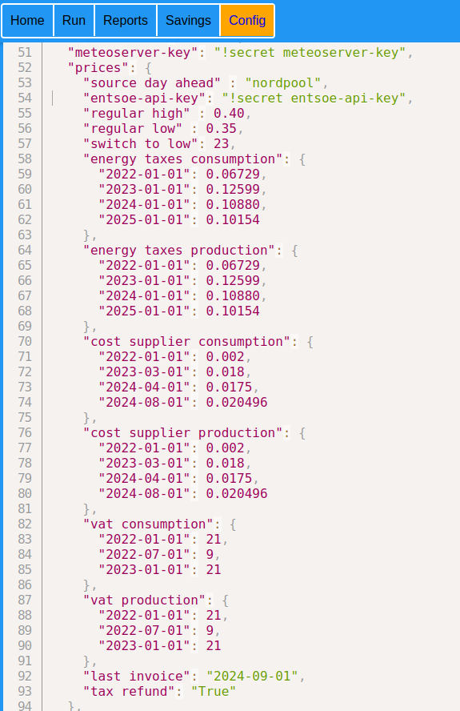

# **刀 Day Ahead Optimizer**
# Installatie en instellingen<br>

## Inhoudsopgave  
[Installatie](#installatie)<br> 
[DAO starten](#dao-starten)<br>
[Instellingen](#instellingen)<br>
[Dashboard](#dashboard) <br>
[Configuratie](#configuratie) <br>
[CO2 emissie](#co2-emissie) <br>
[Api](#api) <br>
[Terminal](#terminal)

**Opmerking**: De verwijzingen in bovenstaand menu en ook verwijzingen naar plaatjes werken niet in de documentatie pagina van de 
add-on. Wil je de documentatie goed lezen open dan een extra tab in je browser met deze verwijzing:
https://github.com/corneel27/day-ahead/blob/main/dao/DOCS.md


*****************************************

## Installatie
De add-on wordt geinstalleerd als een community add-on voor Home Assistant.
Je installeert de add-on als volgt:
In Home Assistant kies je in de zijbalk voor "Instellingen" (Settings), 
daarna voor de optie "Add-ons".
Je kiest met de knop rechtsonder voor "Add-on shop".
In het "drie puntjes menu" rechtsboven kies je voor "Repositories".
Dan krijg je een pop-up waarin je o.a Github repositories kunt toevoegen.
Vul daar  `https://github.com/corneel27/day-ahead/` in en klik op "Toevoegen" (Add).
Na ca 10 seconden staat de add-on in de lijst en kun je de "Beheer de add-onrepositories" dialoog sluiten.
Als je nu je pagina ververst (met F5) staat de nieuw add-on in het overzicht (onder de officiele add-ons).
Klik op de nieuwe add-on en je krijgt het informatie-scherm te zien.

Klik op "Installeer" en wacht enkele minuten (deze tijd is afhankelijk van de snelheid van je processor).
Als de add-on met succes is geinstalleerd krijg je het volgende scherm:
  <br />
Dat is de informatie-pagina van de add-on.
Je hebt bovenin 4 menu-opties:<br>
**Informatie**: Hiermee ga je naar de informatiepagina <br>
**Documentatie**: Hiermee krijg je deze documentatie te zien <br>
**Configuratie**: Hiermee kun je de netwerk-poort van het dashboard wijzigen <br>
**Logboek**: Hiermee krijg toegang tot de logging van de add-on. Handig om te zien wat er fout gaat als iets niet lukt.<br>

Als je klikt op **Toon in zijbalk** kun je altijd makkelijk bij het dashboard van de 
add-on kunt komen. Je kunt ook bij het dashboard komen via de knop **Open web-ui** 
op het informatiescherm van de add-on.

# DAO eerste keer starten
Klik op **Starten** om de add-on te starten. Je moet nu het dashboard kunnen benaderen via de zijbalk 
of via de knop **Open web-ui**. 
De addon opent het dashboard/web-gui op poort 5000:<br>
  <br>
Het kan zijn dat die 
poort op jouw machine in gebruik is door een ander proces. 
Je kunt dan onder de menu-optie **Configuratie** een andere poort instellen 
die wel vrij is
Als je geen dashboard te zien krijgt is er iets fout gegaan.
Kijk op de informatie pagina bij **Logboek** (klik eventueel op vernieuw).
De eerste keer heb je grote kans op veel foutmeldingen omdat veel 
instellingen nog niet goed staan.

## Instellingen
Als je toegang hebt tot het dashboard moet je via het dashboard de 
belangrijkste instellingen eerst goed zetten, zodat alles goed gaat werken.<br>
Dat doe je via de menu-optie "Config" in het dashboard. Je krijgt dan een 
tekst-editor waarmee je de instellingen in json kunt aanpassen
(zie onderstaande afbeelding). Als je 
klaar bent met aanpassen klik je op het "vinkje" en als je "geldige json" 
hebt ingetypt wordt het bestand opgeslagen.
  <br />
Daarvoor moeten de volgende zaken in het configuratiebestand goed ingesteld
worden:
### **Toegang tot homeassistant**
Als je de add-on via Home Assistant installeert hoeft hier niets ingesteld 
  te worden. Dus: <br> `"homeassistant": {},`<br>

### **Toegang tot de database van homeassistant**
De database van Home Assistant wordt door DAO alleen gebruikt om er data 
  uit te lezen voor berekeningen en voor rapportages. Er zullen door DAO 
  geen data in worden weggeschreven.<br>
Er zijn drie mogelijke enginess om te verbinden met de db van Home 
  Assistant. Een en ander is afhankelijk van wat je in Home Assistant hebt 
  ingesteld:
* **sqlite**: dan vul je het volgende in: 
    ```
      "database ha": {
        "engine": "sqlite",
        "database": "home-assistant_v2.db",
        "db_path": "/homeassistant"
      }
    ```
*  **mysql/mariadb** (via een addon van Home Assistant, waarbij zowel 
     de gebruikte database, als de gedefinieerde user `homeassistant` heten). 
     Dan vul je in:
    ```
   "database ha": {
      "engine": "mysql",
      "database": "homeassistant",
      "username": "homeassistant",
      "password": "!secret db_ha_password"
      },```

  waarbij geldt:<br>
    * het veld engine mag weggelaten worden ("mysql" is default)<br>
    * als de database "homeassistant" heet kan deze weggelaten worden 
(Homeassistant is default) <br>
    * als de username "homeassistant" is kan ook deze weggelaten worden.
<br>
    * !secret db_ha_password verwijst naar het gedefinieerde 
      wachtwoord dat je hebt opgenomen in het bestand `secrets.json` 
  * **postgresql** <br>
Een externe database. Je vult bijvoorbeeld in: 
      ```
         "database ha": {
           "engine" : "postgresql",
           "server": "localhost",
           "port": 5432,
           "database": "homeassistant",
           "username": "homeassistant",
           "password": "!secret db_ha_password"
         },
     ```
Meer uitleg over deze instellingen vind je in [Database HA](#database-ha)
  
### **Toegang tot de database van day ahead optimizer**
DAO heeft zijn eigen database om alle benodigde data in op te slaan en om 
  mee te rekenen. DAO onderhoudt zelf deze database.<br>
Ook hier heb je de keuze uit drie engines: dezelfde die je ook 
  toegang geven tot de database van Home Assistant.<br>
Je kunt (zeker als je begint) het beste dezelfde engine voor DAO gebruiken 
  als de engine die jouw Home Assistant gebruikt.
Voor de volledigheid geeft ik voor de drie mogelijke engines de "default" 
  instellingen:<br>
* **sqlite**
  ```
   "database da": {
    "engine": "sqlite",
    "db_path": "../data"
  },
  ```
* **mysql/mariadb**
  ```
   "database da": {
     "engine" : "mysql",
     "database": "day_ahead",
     "username": "day_ahead",
     "password": "!secret db_da_password"
  }, 
  ```
* **postgresql**
  ``` 
  "database da": {
     "engine" : "postgresql",
     "server": "localhost",
     "port": 5432,
     "database": "day_ahead",
     "username": "day_ahead",
     "password": "!secret db_da_password"
   },
  ```
  
    **Opgelet**: Zorg dat de postgres database timezone gelijk is aan de timezone waarin je leeft. 
    Je kunt dit checken door in te loggen op je server en de day_ahead database en dan het volgende commando te geven<br>
`SHOW TIMEZONE;`<br>
Je kunt de timezone eventueel aanpassen met het volgende commando:<br>
`ALTER DATABASE <database naam> SET TIMEZONE TO "<timezone>";` <br>
Je vervangt `<database naam>` door de naam die je hebt ingevuld bij "database" en `<timezone>` door je eigen tijdzone bijvoorbeeld Europe/Amsterdam.


Meer uitleg over deze database instellingen vind je in [Database DA](#database-da)

Als je alles goed hebt ingevuld gaat je weer terug naar het 
Informatiescherm van de add-on en klik op "Herstarten",
zodat alle instellingen worden overgenomen.<br>
Controleer via het Logboek op de informatiepagina of je geen foutmeldingen krijgt tijdens het herstarten.
 Als alles goed is gegaan moet onderaan in (aan het einde van) de logging 
staan (klik evt op "Vernieuwen"):

```
=> directory dao_data exist
=> /root/dao/data doesn't exist, made
=> /root/dao/webserver/app/static/data exist
info:root:Table "variabel" met inhoud gecreeerd.
info:root:Table "values" gecreeerd.
info:root:Table "prognoses" gecreeerd.
info:root:Table "variabel" geupdated.
Setting up watches.
Watches established.
[2024-09-04 12:34:41 +0200] [11] [INFO] Starting gunicorn 21.2.0
[2024-09-04 12:34:41 +0200] [11] [INFO] Listening at: http://0.0.0.0:5000 (11)
[2024-09-04 12:34:41 +0200] [11] [INFO] Using worker: sync
[2024-09-04 12:34:41 +0200] [15] [INFO] Booting worker with pid: 15
[2024-09-04 12:34:41 +0200] [16] [INFO] Booting worker with pid: 16
```
   Voordat het programma kan gaan rekenen moet je eerst een aantal data 
   verzamelen met name van meteogegevens, dynamische uurprijzen en je 
   basisverbruik
### **Meteogegevens**<br>
In Nederland worden te gebruiken meteogegevens ter beschikking gesteld door 
  het bedrijf Meteoserver. Hiervoor heb je een key nodig. Je genereert deze 
  key (token) als volgt:<br> 
* ga naar de website van meteoserver: https://meteoserver.nl/login.php 
* registreer je als gebruiker (onthoudt je inlogcode en je wachtwoord)
* daarna klik je op Account, tabje "API Beheer" en je ziet je key staan<br>
  Opmerking: je kunt gratis maximaal 500 dataverzoeken per maand doen, we 
    doen er maar maximaal 8 per dag = max 248 per maand.
* Je vult die api-key in bij je instellingen. Daar staat nu:<br>
     ```"meteoserver-key": "!secret meteoserver-key",```<br>
     Dat betekent dat je key wordt opgeslagen in het bestand "secrets.json"
* Je klikt boven in het submenu (onder "Config") op "**secrets**" 
* En je vult bij "meteoserver-key" jouw api key in:<br>
```  "meteoserver-key": "<api key>",```<br>
* Klik op het vinkje om je aanpassing op te slaan.
* Om te testen of het geheel werkt: selecteer in het dashboard het 
    Run-menu:<br>
    <br />
* Na ca 30 seconden wordt - als het goed gaat - de logging van deze 
    operatie getoond: <br>
    <br />
<br>
### **Dynamische uurprijzen**<br>
Ook het ophalen van dynamische uurprijzen (day ahead prices) stel je in via 
  het Config-menu, submenu "options", onderdeel **prices** <br>
 <br />
    Daar is alles al ingevuld, maar je kunt het aanpassen aan jouw situatie: <br>
De belangrijkste onderdelen zijn: <br>
    * source day ahead: waar haal je de data vandaan: nordpool is een goede 
 eerste keuze<br>
    * energy taxes consumption: energiebelasting (euro/kWh, ex BTW) bij afname <br>
    * energy taxes production: energiebelasting bij teruglevering (euro/kWh, ex BTW)<br>
    * cost supplier consumption: kosten leverancier voor levering (euro/kWh, ex BTW) <br>
    * cost supplier production; teruggave leverancier bij teruglevering (euro/kWh, ex BTW)<br>
    * vat consumption: btw in procenten bij afname<br>
    * vat production: btw in procenten bij teruglevering<br>

    De meeste onderdelen zijn voorzien van meer regels met een datum. Deze 
      data zijn een begindatum van een nieuw tarief of een nieuwe waarde.<br>
  We kunnen dit onderdeel ook weer testen via het Run-menu van het dashboard:
   <br>
    Daar is nu eerst een vanaf datum ingevuld, maar deze kun je leeg laten. 
  In dat geval zal voor 12 uur de data van vandaag worden opgehaald en 
  vanaf uur zullen de data van morgen worden opgehaald (als ze beschikbaar 
  zijn).<br>
  Dit resulteert dan (als alles goed gaat) in de volgende logging:<br>
   <br>

### **Basisverbruik**<br>
Tenslotte heeft het programma je basisverbruik (=baseload) nodig. Je basisverbruik is 
  het verbruik van je woning voor 24 uur voor alle onderdelen die niet door 
  het programma kunnen worden gestuurd, zoals lampen, koelkast, koken, servers, 
  routers, vijver(s), aquarium enz.<br>
Voor een woning met weinig extra verbruikers ziet het basisverbruik 
  (=baseload) met 24 waarden (voor elk uur van de dag een, te beginnen met 
  het uur van 0:00 tot 1:00) er ongeveer zo uit:
```
  "baseload": [
    0.14,
    0.38,
    0.26,
    0.42,
    0.15,
    0.12,
    0.13,
    0.15,
    0.23,
    0.26,
    0.31,
    0.32,
    0.31,
    0.23,
    0.26,
    0.21,
    0.21,
    0.54,
    0.26,
    0.26,
    0.22,
    0.19,
    0.18,
    0.16
  ],
```
Je kunt deze getallen aanpassen, zodat ze ongeveer overeenkomen met jouw 
basisverbruik.<br>
  In de documentatie verderop zul je nog een methode vinden waarmee je na 
  ca 6 weken gebruik van het programma de baseload door het programma 
  zelf kunt laten berekenenen en dan ook nog verschillend per dag van de 
  week.  

### **Rekenen**
Als je de meteovoorspellingen met succes hebt opgehaald en ook de day-ahead 
prijzen van vandaag en vanaf 13:00 uur ook die van morgen dan kunnen we gaan 
rekenen.<br>
Ga naar het Run menu en klik op **Optimaliseringsberekening met debug**:<br>
  <br>
Na enkele seconden krijg je een logging van de berekening te zien:<br>
  <br>
Omdat we nog geen verplaatsbare verbruikers, een thuisaccu of elektrische auto's hebben 
gedefinieerd zal het programma geen "winst" berekenen.
Je kunt via het Home-menu de grafiek van de berekening oproepen en daar kun je ook de logging opnieuw 
bekijken:
  <br>
Als dat allemaal goed is gegaan kun je ook de **Optimaliseringsberekening zonder debug** doen.
Die zal - als het goed is - dezelfde resultaten laten zien. Toch verschilt deze berekening op twee 
essentiele onderdelen van de berekening met debug:
1. Alle berekende prognoses worden opgeslagen in de database en zijn beschikbaar voor de rapportage 
mogelijkheden van het programma
2. De berekende setpoints en/ofschakelaars voor het eerste uur worden doorgezet naar de daarvoor 
gedefinieerde en geconfigureerde entiteiten in HA, zodat je daadwerkelijke verbruik cq teruglevering ook wordt 
aangepast.<br>


### **Scheduler**
Dan wordt het nu tijd om de scheduler (=takenplanner) te activeren.
Onderaan in je instellingenbestand staan de instellingen van je scheduler:
```  
"scheduler": {
    "active": "False",
    "0355": "get_meteo_data",
    "0955": "get_meteo_data",
    "1555": "get_meteo_data",
    "2155": "get_meteo_data",
    "1255": "get_day_ahead_prices",
    "1355": "get_day_ahead_prices",
    "1455": "get_day_ahead_prices",
    "1554": "get_day_ahead_prices",
    "1655": "get_day_ahead_prices",
    "xx00": "calc_optimum",
    "2359": "clean_data"
  }
```
Je activeert de scheduler door de eerste regel aan te passen: `"active": "True",`. 
Je kunt hem ook weghalen want de default waarde is "True".<br>
Hiermee zorg je ervoor dat:
- Vier keer per dag verse meteodata worden opgehaald 
- Vanaf 12:55 de day-ahead prijzen worden opgehaald. Mocht dat om 12:55 niet lukken dan worden in de navolgende uren 
nieuwe pogingen gedaan.
- Ieder uur een optimale verdeling van je verbruik en productie (teruglevering) berekend.<br>

Als je na opslaan van deze instellingen een uur wacht zul je zien dat de betreffende bewerkingen/berekeningen zijn uitgevoerd. 
Meer gedetailleerde uitleg over de werking van de scheduler en het opnemen van andere bewerkingen in de scheduler 
vind je bij [Scheduler](#schedulerbr)


Als dit allemaal goed is gegaan kun je beginnen met (verplaatsbare) verbruikers en producenten zoals
een thuisaccu, je zonnepanelen, elektrische auto('s) enz te configureren. Het advies is: 
werk stap voor stap. Eerst een onderdeel goed definieren en testen en als dat onderdeel allemaal 
goed werkt het volgende onderdeel.
Het beste kun je de volgende volgorde aanhouden (maar hoeft niet): <br>
- zonnepanelen die invoeden op 230V (dus nog geen hybride omvormer(s), als je meer sets/omvormers hebt per set
- thuisaccu
- thuisaccu met hybride omvormer(s)
- elektrische auto('s), een voor een
- warmtepomp
- boiler
- huishoudelijke apparatuur, zoals vaatwasser, wasmachine, wasdroger (een voor een)

Je kunt het geheel geleidelijk opbouwen, testen en in productie nemen.

Per onderdeel stel ik de volgende werkwijze voor:
- lees eerst de documentatie met alle configuratiemogelijkheden goed door (RTFM)
- kopieer de betreffende instellingen uit `options_example.json` naar jouw instellingen. 
  Let daarbij op het volgende: 
  - Van de warmtepomp en de boiler kun je er maar een hebben. <br>
    Door de instelling `"present": "True"` activeer je de warmtepomp of boiler
  - Van alle andere verbruikers kun je er 0, 1 of meer hebben. Het programma verwacht dat alle verbruikers
    van een onderdeel tussen "vierkante haken" staan. Dus:<br>
         
     - ```"solar": [],``` betekent geen zonnepanelen
      - 1 set zonnepanelen definieer je met <br>
      ```
        "solar": [
          { "name" : "woning",
            "entity pv switch": "input_boolean.pv_woning_aan_uit"
            "tilt": 35,
            "orientation": 5,
            "capacity": 4.2,
            "yield": 0.009, 
        }],
    ```
    
    - twee sets definieer je als volgt: 
    ```  
    "solar": [
      {"name": "pv woning",
       "entity pv switch": "input_boolean.pv_woning_aan_uit"
       "tilt": 35,
       "orientation": 5,
       "capacity": 4.2,
       "yield": 0.010, 
      },
      {"name": "pv garage",
       "entity pv switch": "input_boolean.pv_garage_aan_uit"
       "tilt": 45,
       "orientation": 5,
       "capacity": 1.8,
       "yield": 0.005,
      }
    ],
    ```
    **Opmerking**<br>
  Vanaf versie 2025.7.1 worden ook de configuratie van meer strings per set ondersteund. <br>
  Zie verder bij solar.
---

---

## Dashboard

### Dashboard benaderen
Het programma wordt geleverd met een webserver die je als een dashboard voor de aansturing van de addon en voor diverse rapportages kunt benaderen.
Je kunt het dashboard op drie manieren benaderen:
* Via het informatiescherm van de add-on en dan de knop **Open web-ui**
* Via de zijbalk in Home Assistant (als je dat hebt ingesteld)
* Via je browser:
* Je benadert de webserver/het dashboard met een browser als volgt:<br>
  * ```http://<ip-adres>:<ip-poort>/```, waarbij je voor:<br />
  * ```<ip-adres>``` het ip-adres invult van ja HA machine waarop ook de webserver draait<br>
  * ```<ip-poort``` het poortnummer invult waarop je de webserver kunt bereiken (zie verder).<br/>

Bijvoorbeeld : ```http://192.168.178.36:5000/```

De specifieke instellingen voor het dashboard staan ook in options.json onder de sleutel **dashboard**
Je kunt de volgende instellingen maken:
* port: dit is de poort op de server waarop je de webserver kunt benaderen.

### Dashboard menu
Het hoofdmenu van het dashboard bestaat uit 4 opties: <br />
   <br />

- Home
- Run
- Reports
- Savings
- Config

**Home**<br/>
Deze webpagina komt ook naar voren als je de webserver via je browser 
benadert: <br />
   <br />
Daarin toont zich een submenu met daarin de informatie die je met submenu selecteert:
Het submenu geeft links de keuze de keuze uit (voorlopig twee **onderwerpen**):
 - grid (deze is nu actief, dat wordt aangegeven met de kleur rood)
 - accu1 (de naam van je accu), helaas werkt dit nog niet <br />

In het midden van het submenu kun je kiezen **hoe** je de gevraagde informatie wil zien:
 - grafiek (nu actief)
 - tabel <br />

Rechts kun je bladeren door de aangeboden informatie:
- **|<** de oudste aanwezige grafiek/tabel
- **<** de vorige
- **>** de volgende
- **>|** de nieuwste, meest recente grafiek/tabel
-  met de afvalbak kun je de aangeboden informatie verwijderen

**Run**<br/>
 <br />
Via deze menu-optie kun je alle mogelijke berekeningen en bewerkingen van het programma activeren 
(zie ook het begin van deze handleiding). <br/>
Je activeert een bewerking door deze aan te klikken.<br/>
Je krijgt direct een bevestiging dat de betreffende berekening/bewerking wordt uitgevoerd.<br/>
Na 10 tot 15 seconden komt het log-bestand van de bewerking/berekening in beeld.
Wil je het grafische resultaat van een optimaliseringsberekening zien klik dan op "Home",
Je krijgt dan de laatste berekende grafiek in beeld.

Bij het ophalen van day ahead prijzen kun je twee datums invullen (formaat jjjj-mm-dd).
Laat je deze velden leeg dan zullen de prijzen van vandaag (als je de actie voor 12 uur uitvoert) of morgen (na 12 uur) worden opgehaald.
Vul je alleen "prijzen vanaf" in dan zal vanaf die dag tot vandaag de prijzen worden opgehaald. Behalve bij nordpool,
die kan maar gegevens van een etmaal tegelijk ophoesten en dus alleen van de dag die je invult bij "prijzen vanaf".  
Controleer de getoonde logging of alles gaat zoals je het verwacht.
Als je bijvoorbeeld van een periode terug de prijzen wilt ophalen, krijg je dit scherm: 


**Reports**<br/>
 <br />
Dit onderdeel is nog in ontwikkeling, maar biedt nu al veel mogelijkheden.<br/>
Er zijn twee rapportmogelijkheden:
- **grid** Hiermee krijg je inzicht in je energieverbruik, maar ook je productie (teruglevering) aan je leverancier
maar ook je kosten, opbrengsten, nettokosten en het (gemiddelde) tarief dat je daarvoor hebt betaald of teruggekregen.
- **balans** Dit geeft een tabel/grafiek met de energiebalans van je aansluiting.<br>
 Wat komt er binnen: inkoop (verbruik), zonne-energie, productie (ontladen) van je thuisbatterij. <br>
 Wat gaat er uit: teruglevering(productie), warmtepomp, boiler, laden van je batterij, basisverbruik (baseload).<br>
 **Opmerking** Dit onderdeel werkt alleen goed als je van alle bovengenoemde energiestromen in HA het verbruik registreert in
 het energiedashboard van Home Assistant en je de betrokken entiteiten hebt ingevuld
 bij de instellingen bij onderdeel "report"

Bij beide onderwerpen kun je kiezen uit twee weergaven:
- grafiek, het grafische deel werkt nu nog basaal, maar wordt ook nog verder uitgewerkt.
- tabel

In het pull-down menu kun je de periode kiezen waarvan je een rapport wil zien.
Je hebt de keuze uit de volgende perioden:
* vandaag _*_ <br/>
* vandaag en morgen (alleen zinvol na 13:00 uur) _*_ <br/>
* gisteren <br/>
* deze week _*_ <br/>
* vorige week <br/>
* deze maand _*_ <br/>
* vorige maand <br/>
* dit jaar _*_ <br/>
* vorig jaar <br/>
* dit contractjaar _*_ <br/>
* 365 dagen

Bij de perioden met een _*_ hebben je de optie "met prognose".
Als je die aanvinkt wordt een rapportage berekend inclusief de resultaten van de laatst uitgevoerde optimaliseringsberekening.
Dit geldt zowel voor de tabel als de grafiek. In de toekomst zullen in de grafiek de "prognose waarden" iets afwijkend worden getoond.

**Savings**<br/>
Hiermee bereken en rapporteer je je besparingen die je realiseert door de inzet van je thuisbatterij(en) op de volgende onderdelen:
* **verbruik**<br/>
Je verbruik zal altijd groter worden door de inzet van je batterij, omdat deze altijd een rendement onder de 100% zal hebben. Dus je realiseert op je verbruik meestal een negatieve besparing (dus een toename).
* **kosten**<br/>
Als je je baterij goed inzet met de strategie "minimaliseer kosten" zul je dus financiele besparingen
realiseren. Diekun je dusmet deze rapportage zichtbaar maken.
In tabelvorm:
  <br />
In grafiekvorm:
  <br />

* **CO2**<br>
Het inzetten van je batterij met beide strategieen zal meestal ook betekenen dat teruglevert bij een groot aandeel fossiel in de opwekking van elektriciteit
en gebruik van elektriciteit uit het net bij een laag aandeel fossiel in de elektriciteitsmix.
Met deze rapportage maak je deze besparing zichtbaar.

**Settings**<br/>
-    ***Options***<br/>
Hiermee kun je het instellingen bestand (options.json) bewerken
- ***Secrets***<br />
Hiermee bewerk je het bestand (secrets.json) met je wachtwoorden en andere zaken die je niet in options.json wil opnemen.

---

## Configuratie

Na de eerste installatie van de add-on wordt er een bestand aangemaakt (gekopieerd van options_vb.json) met alle instellingen van het programma.
Het bestand `options.json` in de folder bevat alle instellingen voor het programma day_ahead.py en dien je zelf aan te maken. Het voorbeeld bestand `options_vb.json` kun je als basis gebruiken en dien je aan passen naar jouw omgeving en omstandigheden.<br>
Alle instellingen die beginnen met "!secret" komen in het bestand `secrets.json` te staan met de key die hier achter !secret staat.
Deze bestanden staan lokaal in de map `\config`, maar zijn extern benaderbaar met Samba.<br>
Er zijn twee manieren om bestanden aan te passen:
* als je de HA-add-on Samba hebt geinstalleerd, krijg je met je bestandenbladeraar (bij Windows is dat de Explorer, bij Mac Finder) 
toegang o.a. tot de folder `/add-on_configs/xxx_day_ahead_opt` van je Home Assistant machine. 
In de submap `dao_data` staan de genoemde configuratie bestanden. Je kunt dan met je eigen teksteditor (bijv notepad) de bestanden aanpassen.<br>
 Let op gebruik geen Word of iets dergelijks, want die plaatsen opmaak codes in de tekst.<br>
* via het dashboard van de add-on (als deze kan opstarten) kun je via de menu-opties `\Config\options` en `\Config\secrets`

Als je twijfelt hoe je iets moet invullen:
* kijk in het voorbeeldbestand options_vb.json
* stel een vraag op github onderdeel `Discussions`

Hieronder staat voor de verschillende onderdelen van options.json uitgelegd welke informatie dient te worden ingevuld.
Ga je hier voor de eerste keer mee aan gang volg dan de volgende aanpak:
* vul eerst de meest noodzakelijke informatie in: 
    * homeassistant
    * database da
    * database ha
    * meteoserver
    * prices
    * baseload (als je die niet weet: neem tijdelijk de baseload over van het voorbeeld) 
* zet de volgende instellingen op "standaard":
  * graphical backend: blanko ("")
  * graphics: default
  * strategy: minimize cost
  * notifications bij opstarten en berekening: false
  * grid, max_power: 17 kW (komt overeen met 3 x 25 A)
  * dashboard, port: 5000
* laat de rest "blanko" 
  * boiler, boiler present false
  * heating, heater present false
  * battery: leeg = "[ ]"
  * solar: leeg = "[ ]"
  * electric vehicle: leeg = "[ ]"
  * tibber nog niet invullen of wijzigen
  * scheduler: alles laten staan
* Kijk nu of de add-on wil opstarten, kijk na ca 10 seconden naar de logging en probeer
in je browser het dashboard van de add-on te bereiken: `http://<ipadres van homeassistant>:5000`
* Als dit allemaal werkt kun je een verbruiksonderdeel invullen waarmee het programma het verbruik kan "schuiven".
Als je dit hebt ingevuld laat dan het programma via het menu van het dashboard rekenen:<br> 
\Run\Optimaliseringsberekening met debug. Dit duurt een aantal seconden. Inspecteer het resultaat en pas
desgewenst je instelling aan. Ben je tevreden: vul een volgende gebruiker en je solar data in en ga zo verder.

### **Overzicht van alle instellingen**
In onderstaande tabel is een overzicht opgenomen van alle instellingen. Als voor jou de default-waarde voldoet 
dan kun je die (sub)instelling achterwege laten en zorgt het programma voor de default-waarde.
Als je de software installeert als addon op je Home Assistant machine kan de hele instelling **homeassistant** weggelaten worden. 
Dit regelt de supervisor van Home Assistant dan voor je.

----------------------------

| Key                      | Subkey                       | Type             | Default                            | Opmerkingen                                        |
|--------------------------|------------------------------|------------------|------------------------------------|----------------------------------------------------|
| **homeassistant**        | protocol api                 | string           | http                               | Alleen invullen                                    |
|                          | host                         | string           | supervisor                         | als addon op                                       |  
|                          | ip port                      | integer          | blanco                             | andere machine                                     | 
|                          | token                        | string           | blanco                             | draait                                             | 
| **database ha**          | engine                       | string           | mysql                              | keuze uit: mysql / sqlite / postgresql             |
|                          | server                       | string           | core-mariadb                       | default als addo met mysql als engine              |
|                          | database                     | string           | homeassistant                      |                                                    |
|                          | username                     | string           | homeassistant                      |                                                    |
|                          | password                     | string           |                                    |                                                    |
| **database da**          | engine                       | string           | mysql                              | keuze uit: mysql / sqlite / postgresql             |
|                          | server                       | string           | core-mariadb                       | default als addon met mysql als engine             |
|                          | database                     | string           | day_ahead                          |                                                    |
|                          | username                     | string           | day_ahead                          |                                                    |
|                          | password                     | string           |                                    |                                                    |
| **meteoserver-key**      |                              | string           |                                    |                                                    |
| **prices**               | source day ahead             | string           | nordpool                           | keuze uit: nordpool / entsoe / easyenergy / tibber |
|                          | entsoe-api-key               | string           |                                    | alleen bij entsoe als source                       |
|                          | regular high                 | getal            |                                    |                                                    |
|                          | regular low                  | getal            |                                    |                                                    |
|                          | switch to low                | integer          | 23                                 |                                                    |
|                          | energy taxes consumption     | list             |                                    | {datum : getal}                                    |
|                          | energy taxes production      | list             |                                    | {datum : getal}                                    |
|                          | cost supplier consumption    | list             |                                    | {datum : getal}                                    |
|                          | cost supplier production     | list             |                                    | {datum : getal}                                    |
|                          | vat consumption              | list             |                                    | {datum : getal}                                    |
|                          | vat production               | list             |                                    | {datum : getal}                                    |
|                          | last invoice                 | datum            |                                    | begindatum contract                                |
|                          | tax refund                   | boolean          |                                    |                                                    |
| **log level**            |                              | string           | "info"                             | keuze uit "debug", "info", "warning" of "error"    |
| **use_calc_baseload**    |                              | boolean          | "False"                            |                                                    |
| **baseload calc periode** |                              | getal            | 56                                 | alleen als "use_calc_baseload" = True              | 
| **baseload**             |                              | list 24 getallen |                                    | alleen als "use_calc_baseload" = False             | 
| **graphical backend**    |                              | string           | ""                                 |                                                    |
| **graphics**             | style                        | string           | "default"                          | kies uit lijst                                     |
|                          | battery balance              | boolean          | "True"                             |                                                    |
|                          | prices consumption           | boolean          | "True"                             |                                                    |
|                          | prices production            | boolean          | "True"                             |                                                    |
|                          | average consumption          | boolean          | "True"                             |                                                    |
|                          | show                         | boolean          | "False"                            |                                                    |
| **strategy**             |                              | string           | "minimize cost"                    | "minimize cost" of "minimize consumption"          |
| **notifications**        | notification entity          | string           | ""                                 |                                                    | 
|                          | opstarten                    | boolean          | "False"                            | 
|                          | berekening                   | boolean          | "False"                            |                                                    | 
|                          | last activity entity         | string           | ""                                 |                                                    | 
| **grid**                 | max_power                    | getal            | 17                                 |                                                    | 
| **history**              | save days                    | getal            | 7                                  |                                                    | 
| **dashboard**            | port                         | getal            | 5000                               |                                                    | 
| **boiler**               | boiler present               | boolean          | "False"                            |                                                    | 
|                          | entity boiler enabled        | string           |                                    | bij afwezigheid wordt boiler ingepland             |
|                          | entity actual temp.          | string           |                                    |                                                    |
|                          | entity setpoint              | string           |                                    |                                                    |
|                          | entity hysterese             | string           |                                    |                                                    |
|                          | cop                          | getal            |                                    | kWh/kWh                                            |
|                          | cooling rate                 | getal            |                                    | K/h                                                |
|                          | volume                       | getal            |                                    | liter                                              |
|                          | heating allowed below        | getal            |                                    | °C                                                 |
|                          | elec. power                  | getal            |                                    | W                                                  |
|                          | boiler heated by heatpump    | boolean          | "True"                             | W                                                  |
|                          | activate service             | string           |                                    |                                                    |
|                          | activate entity              | string           |                                    |                                                    |
|                          | entity instant start         | string           |                                    | input_boolean                                      |
| **heating**              | heater present               | boolean          | "False"                            |                                                    | 
|                          | entity hp enabled            | string           |                                    | bij afwezigheid wordt heatpump ingepland           |
|                          | entity hp heat demand        | string           |                                    |                                                    |
|                          | degree days factor           | getal of string  |                                    | kWh/K.day of HA 'sensor' entity                    | 
|                          | adjustment                   | string           | "power"                            | type besturing warmtepomp                          |
|                          | entity hp heat produced      | string           |                                    |                                                    |
|                          | entity hp switch             | string           |                                    |                                                    |
|                          | entity avg outside temp      | string           |                                    |                                                    |
|                          | entity hp cop                | string           |                                    | als geen entity is ingevuld, wordt cop=4  kWh/kWh  |
|                          | entity hp power              | string           |                                    | als geen entity is ingevuld, wordt power=1,5 kW    |
|                          | min run length               | getal            | 1                                  |                                                    |
|                          | stages                       | list             |                                    | {max_power, cop}                                   | 
|                          | ______max_power              | getal            |                                    | W                                                  | 
|                          | ______cop                    | getal            |                                    | kWh/kWh                                            | 
|                          | entity adjust heating curve  | string           |                                    | kWh/kWh                                            | 
|                          | adjustment factor            | getal            |                                    | K                                                  | 
| **battery**              |                              | list             |                                    | 0, 1 of meer {..}                                  | 
|                          | name                         | string           |                                    |                                                    |
|                          | name                         | string           |                                    |                                                    |
|                          | entity actual level          | string           |                                    |                                                    |
|                          | upper limit                  | getal            |                                    | %                                                  |
|                          | lower limit                  | getal            |                                    | %                                                  |
|                          | optimal lower level          | getal            |                                    | %                                                  |
|                          | entity actual level          | string           |                                    |                                                    |
|                          | entity min soc end opt       | string           | 0                                  |                                                    |
|                          | entity max soc end opt       | string           | 100                                |                                                    |
|                          | charge stages                | list             |                                    | {power, efficiency}                                | 
|                          | ______power                  | getal            |                                    | W                                                  | 
|                          | ______efficiency             | getal            |                                    | W/W (factor 0..1)                                  | 
|                          | discharge stages             | list             |                                    | {power, efficiency}                                | 
|                          | ______power                  | getal            |                                    | W                                                  | 
|                          | ______efficiency             | getal            |                                    | W/W (factor 0..1)                                  | 
|                          | reduced hours                | uur-waarde paren | {}                                 | W                                                  |
|                          | minimum power                | getal            |                                    | W                                                  |
|                          | dc_to_bat efficiency         | getal            |                                    | 0 .. 1.0                                           |
|                          | dc_to_bat max power          | getal            | 2 x max power charge               | W                                                  |
|                          | bat_to_dc efficiency         | getal            |                                    | 0 .. 1.0                                           |
|                          | bat_to_dc max power          | getal            | 2 x max power discharge            | W                                                  |
|                          | cycle cost                   | getal            |                                    | euro                                               |
|                          | entity set power feedin      | string           |                                    | input_number                                       |
|                          | entity stop inverter         | string           |                                    | input_datetime                                     |
|                          | entity balance switch        | string           |                                    | input_boolean                                      |
|                          | solar                        | list             |                                    | 0, 1 of meer {..} pv_dc, zie solar (pv_ac)         | 
| **solar**                |                              | list             |                                    | 0, 1 of meer {..}  pv_ac                           | 
|                          | name                         | string           |                                    |                                                    |
|                          | entity pv switch             | string           | ""                                 | input_boolean                                      |
|                          | max power                    | getal            |                                    | kW                                                 |
|                          | strings                      | list             |                                    | 1 of meer {..}                                     | 
|                          | tilt                         | getal            |                                    | helling 0 ..90                                     |
|                          | orientation                  | getal            |                                    | -180(N) ..-90(O)..0(Z) ..90(W)..180(N)             |
|                          | capacity                     | getal            |                                    | kWp                                                |
|                          | yield                        | getal            |                                    | Wh/J/cm2                                           |
| **electric vehicle**     |                              | list             |                                    | 0, 1 of meer {..}  electric vehicle                | 
|                          | name                         | string           |                                    |                                                    |
|                          | capacity                     | getal            |                                    | kWh                                                |
|                          | entity position              | string           |                                    | tracker                                            |
|                          | entity actual level          | string           |                                    |                                                    |
|                          | entity plugged in            | string           |                                    | binary_sensor                                      |
|                          | charging stages              | list             |                                    | 2 of meer {..}                                     | 
|                          | ______ampere                 | getal            |                                    | A                                                  | 
|                          | ______efficiency             | getal            | 1                                  | factor 0..1                                        | 
|                          | charge three phase           | boolean          | true                               | true of false                                      |
|                          | charge scheduler             |                  |                                    |                                                    |
|                          | _____entity set level        | string           |                                    | input_number                                       |
|                          | _____level margin            | getal            | 0                                  |                                                    |
|                          | _____entity ready datetime   | string           |                                    | input_datetime                                     |
|                          | entity set charging ampere   | string           |                                    | input_number                                       |
|                          | charge switch                | string           |                                    | input_boolean                                      |
|                          | entity stop laden            | string           | ""                                 | input_datetime                                     |
|                          | entity instant start         | string           |                                    | input_boolean                                      |
|                          | entity instant level         | string           |                                    | input_number                                       |
| **machines**             |                              | list             |                                    | 0, 1 of meer {..}  pv_ac                           | 
|                          | name                         | string           |                                    |                                                    |
|                          | programs                     | list             |                                    | 1 of meer {..} progrma                             |
|                          | _____name                    | string           |                                    |                                                    |
|                          | _____power                   | list of numbers  |                                    | 0, 1 of meer numbers                               |
|                          | entity start window          | string           |                                    | input_datetime, tijd                               |
|                          | entity end window            | string           |                                    | input_datetime, tijd                               |
|                          | entity selected program      | string           |                                    | input_select                                       |
|                          | entity calculated start      | string           | ""                                 | input_datetime, datum en tijd                      |
|                          | entity calculated end        | string           | ""                                 | input_datetime, datum en tijd                      |
|                          | entity instant start         | string           |                                    | input_boolean                                      |
| **tibber**               | api url                      | string, url      | https://api.tibber.com/v1-beta/gql | desgewenst                                         | 
|                          | api_token                    | string           |                                    |                                                    |
| **report**               | entities grid consumption    | list of string   | []                                 |                                                    | 
|                          | entities grid production     | list of string   | []                                 |                                                    | 
|                          | entities solar production ac | list of string   | []                                 |                                                    | 
|                          | entities solar production dc | list of string   | []                                 |                                                    | 
|                          | entities ev consumption      | list of string   | []                                 |                                                    | 
|                          | entities wp consumption      | list of string   | []                                 |                                                    | 
|                          | entities boiler consumption  | list of string   | []                                 |                                                    | 
|                          | entities battery consumption | list of string   | []                                 |                                                    | 
|                          | entities battery production  | list of string   | []                                 |                                                    | 
|                          | entity co2-intensity         | list of string   | []                                 |                                                    | 

| **scheduler**            | active                       | boolean          | True                               | 
|                          |                              | list             | {time, task}                       |                                                   | 

 

### **homeassistant**<br>
Dit onderdeel hoeft alleen ingevuld te worden als je met het programma werkt buiten de add-on.<br>
Dus als je met de add-on werkt kun je volstaan met: `homeassistant: {},`
Heb je software buiten de add-on geinstalleerd dan moet dit onderdeel wel worden ingevuld:
 * protocol api: hiermee geeft je aan met welke protocol jouw HA installatie (homeassistant core)
bereikbaar is. Je kunt kiezen uit `http` (zonder ssl) of `https` (met ssl).
 * host: het ip-adres of de domein-naam waar je home assistant installatie bereikbaar is.  
 * ip port: de ip-poort waar je home assistant installatie bereikbaar is.
 * token: om de api te kunnen aanroepen is er een token nodig.  
   Deze kun je genereren in Home Assistant in je profiel. Maak een token met lange levensduur aan.
   Check of je alle netjes kopieert en tussen quotes zet zonder per ongeluk een extra spatie mee te nemen.

### **Database HA**
De database van Home Assistant. Deze wordt gebruikt om de rapporten te kunnen genereren.
Vul de volgende gegevens in:
 * engine: je hebt de keuze uit mysql (=mariadb), postgresql, sqlite
 * server: (is niet van toepassing als je kiest engine sqlite) voer ip adres van de server
(waar mysql, mariadb of postgresql draait); kan achterwege blijven als je werkt met de dao add-on en ok mariadb hebt geinstalleerd als addon
 (default = "core-mariadb")
 * database: naam van de database, default "homeassistant", als je engine sqlite is dan wordt dit de naam van het database-bestand: `homeassistant_v2.db`
 * port: poort op de server, default 3306, niet van toepassing bij engine sqlite
 * username: user name, default "homeassistant", niet van toepassing bij engine sqlite
 * password: wachtwoord, niet van toepassing bij engine sqlite
 * db_path: (alleen van toepassing bij engine sqlite) het pad naar de folder waar het databasebestand in zit (meestal `/config`) 

Onderstaand zijn voor de drie mogelijke engines de meest voorkomende configuraties weergegeven.
- **sqlite**  
  ```
  "database ha": {
    "engine": "sqlite",
    "database": "home-assistant_v2.db",
    "db_path": "/homeassistant"```
  }

- **mysql** (geldt ook voor mariadb) 
    ```
    "database ha": {
      "engine" : "mysql",
      "server" : "core-mariadb",
      "database": "homeassistant",
      "username": "homeassistant",
      "password": "!secret db_ha_password"
    }
    ```

  Opmerking: als mariadb als addon is geinstalleerd (net als dao) 
dan kan de regel `"server" : "core-mariadb"` (defaultwaarde) vervallen.
-  **postgresql**
    ```
    "database ha": {
      "engine" : "postgresql",
      "server": "localhost",
      "port": 5432,
      "database": "homeassistant",
      "username": "homeassistant",
      "password": "!secret db_ha_password"
    },
   ```
 
    Opmerking: zorg voor voldoende rechten voor de user (in dit geval `homeassistant`)


### **Database DA**
De database voor het day ahead programma.  
Je vult hier de gegevens in die je ingevuld tijdens het aanmaken van het 
gebruikersaccount en de database voor Day Ahead Optimization:
 * engine: je hebt de keuze uit mysql (=mariadb), postgresql, sqlite 
 * server: (is niet van toepassing als je kiest engine sqlite) voer ip adres van de server
(waar mysql, mariadb of postgresql draait); kan achterwege blijven als je werkt met de dao add-on en ok mariadb hebt geinstalleerd als addon
 (default = "core-mariadb")
 * database: naam van de database, default "day_ahead", als je engine sqlite is 
dan komt hier de naam van het database-bestand: `day_ahead.db`
 * port: poort op de server, default 3306, niet van toepassing bij engine sqlite
 * username: user name, default "day_ahead", niet van toepassing bij engine sqlite
 * password: wachtwoord, niet van toepassing bij engine sqlite
 * db_path: (alleen van toepassing bij engine sqlite) het pad naar de folder 
waar het databasebestand staat (meestal `../data`) <br> 

Onderstaand zijn voor de drie mogelijke engines de meest voorkomende configuraties weergegeven.
- **sqlite**  
  ```
  "database da": {
    "engine": "sqlite",
    "db_path": "../data"
  },
    ```
- **mysql** (geldt ook voor mariadb)     
```

 "database da": {
    "engine" : "mysql",
    "server": "core-mariadb",
    "port": 3306,
    "database": "day_ahead",
    "username": "day_ahead",
    "password": "!secret db_da_password"
  },
  ```
* **postgresql**
```
 "database da": {
    "engine" : "postgresql",
    "server": "localhost",
    "port": 5432,
    "database": "day_ahead",
    "username": "day_ahead",
    "password": "!secret db_da_password"
  },
 ```

### **meteoserver-key**<br>
De meteodata worden opgehaald bij meteoserver. Ook hiervoor heb je een key nodig. Je genereert deze key (token) als volgt:<br> 
 * website: https://meteoserver.nl/login.php 
 * registreer je als gebruiker 
 * daarna klik je op Account, tabje "API Beheer" en je ziet je key staan<br>
 Opmerking: je kunt gratis maximaal 500 dataverzoeken per maand doen, we doen er maar 4 per dag = max 124 per maand.

### **prices**<br>
 * source day ahead, default "nordpool"
     Hier bepaal je waar je je day ahead prijzen vandaan wilt halen. Je hebt de keuze uit drie bronnen:
   * nordpool
   * entsoe
   * easyenergy
   * tibber<br>

    Als je kiest voor **entsoe** dan moet je hieronder een api key invullen.
 * entsoe-api-key:  
	  Deze key genereer je op de site van entsoe en heb je nodig om daar de energieprijzen van de volgende op te halen.
    Je genereert deze key (token) als volgt: 
   * Website: https://transparency.entsoe.eu      
   * Registreer je als gebruiker 
   * Vraag via een email naar transparency@entsoe.eu met “Restful API access” als onderwerp. 
     Vermeld het email adres waarmee je je hebt geregistreerd in de body van de email. 
     De ENTSO-E Helpdesk doet haar uiterste besto binnen 3 werkdagen te reageren.
   * Na ontvangst van een positieve reactie:
   * Log in
   * Klik op "My Account Settings"  
   * Klik op "Generate a new token"
   * Meer info: https://transparency.entsoe.eu/content/static_content/Static%20content/web%20api/Guide.html
   Hoofdstuk 2 Authentication and Authorisation<br><br>
 
   Als je kiest voor **tibber** werkt dit alleen als je:
   * klant bent bij tibber
   * een personal token hebt opgehaald en ingevuld bij de instellingen onder **tibber** (zie verderop)<br>
    <br>   


 * regular high: het hoge tarief van een "reguliere" oude leverancier,
   excl. btw, kaal, euro per kWh
 * regular low: idem het "lage" tarief, excl. btw, kaal , euro per kWh
 * switch to low: tijdstop waarop je omschakelt naar "laag tarief", default 23
 * energy taxes consumption: energiebelasting op verbruik excl. btw, euro per kWh:<br> 
      *  2022-01-01 : 0.06729,  
      *  2023-01-01 : 0.12599,
      *  2024-01-01 : 0.10880,
      *  2025-01-01 : 0.10154
 * energy taxes production: energiebelasting op teruglevering excl. btw, euro per kWh  
      *  2022-01-01 : 0.06729,  
      *  2023-01-01 : 0.12599, 
      *  2024-01-01 : 0.10880,
      *  2025-01-01 : 0.10154
 * cost supplier consumption: opslag leverancier euro per kWh, excl. btw  
        bijv voor Tibber:
      * 2022-01-01: 0.002
      * 2023-03-01: 0.018
      * 2023-09-01: 0.009
      * 2024-04-01: 0.0175,
      * 2024-08-01: 0.020496
 * cost supplier production:  opslag leverancier voor teruglevering per kWh, ex btw  
      bijv voor Tibber:
      * 2022-01-01: 0.002
      * 2023-03-01: 0.018
      * 2023-09-01: 0.009
      * 2024-04-01: 0.0175,
      * 2024-08-01: 0.020496

  * vat:    btw in %  
      * 2022-01-01: 21
      * 2022-07-01: 9
      * 2023-01-01: 21,  
   
  * last invoice: datum laatste jaarfactuur en/of de begindatum van je contractjaar (formaat "yyyy-mm-dd")
  * tax refund: kun je alles salderen of is je teruglevering hoger dan je verbruik  (True of False) 

### **logging level**
De output van het programma wordt opgeslagen in logfiles.
Je kunt zelf bepalen hoe gedetailleerden uitgebreid deze output is:
Daarvoor gebruik je het logging level.
Je kunt kiezen uit vier levels:
- debug: heel gedetailleerd
- info (default): beperkt maar toch nog redelijk wat informatie.
- warning: je krijgt alleen waarschuwingen bij mogelijke fouten in de toekomst
- error: er komt alleen output als er iets fout gaat.<br>

Zet je het level op op info dan krijg je ook alle meldingen van info maar ook die van warning en error.
<br>Als je begint kun je het level het best op debug zetten, maar als alles lekker loopt
kun je het level hoger zetten.

### **baseload**<br> 
De baseload is het basisverbruik van je woning: dus al het verbruik waarop het programma geen invloed heeft.
Deze kan op twee manieren worden verkregen:
* je laat het programma deze berekenen
* je geeft het hier op 

#### baseload berekenen
Als je de baseload door het programma wilt laten berekenen moet je de volgende instellingen meegeven:
* "use_calc_baseload": "True"/"False" default "False" <br>
Hiermee vertel je het programma dat de baseload moet worden berekend. 
* "baseload calc periode": default 56<br>
Hiermee geeft je het aantal dagen op waarover de baseload moet worden berekend
* Bij report (zie hierna) vul je de sensoren waarmee Home Assistant middels een oplopende tellerstand
het verbruik of de productie van alle relevante beinvloedbare gebruikers registeert. 
* Dat zijn dezelfde soort sensoren die je opgeeft bij de configuratie van het energiedashboard van HA.
  * grid consumption
  * grid production
  * battery consumption
  * battery production
  * solar production ac
  * ev consumption
  * wp consumption
  * boiler consumption<br>
* In de scheduler (zie hierna) zet je een regel met een commando dat de baseloads iedere dag 
een keer worden geactualiseerd: <br> bijvoorbeeld ` "2230": "calc_baseloads"`
  
**opmerking**:<br>
- Als je iets niet hebt (bijvoorbeeld geen elektrische auto) dan laat je de lijst achter het onderdeel leeg.<br>
 Bijvoorbeeld: `"entities ev consumption": []`


#### baseload opgeven
Je zet "use_calc_baseload": "False" (default) of je laat deze regel weg (false is de default waarde)<br>
Je vult bij "baseload" 24 waarden in een lijst. Dat is voor de 24 uren van een etmaal het basisverbruik van je woning.
Deze bepaal je als volgt:<br>
* neem voor een voldoende lange periode (minimaal een maand) de geregistreerde energiehoeveelheden per uur op de volgende onderdelen:
* inkoop van je aansluiting op het netwerk: inkoop 
* teruglevering van je aansluiting op het netwerk: teruglevering
* het verbruik van je warmtepomp: wp
* het verbruik van je boiler: boiler
* het totale verbruik van je elektrische auto('s): ev
* de totale productie van je zonnepanelen: pv<br>
Als in deze periode ook je batterij al gedraaid heeft:
* de energie naar je batterij: accu_in
* de energie uit je batterij: accu_uit
* de basislast voor ieder uur reken je uit met de volgende formule:<br>
* basislast = inkoop - teruglevering - wp - boiler - ev + pv - accu_in + accu_uit
* de resultaten zet je samen met het begintijdstip van ieder uur in een spreadsheet<br>
  dat ziet er dan als volgt uit: <br>
  
* daarnaast begin je een nieuwe tabel met in de eerste kolom de getallen 0, 1 tot en met 23
* in de tweede kolom bereken je met "averageif" (of in libreoffice "gemiddelde.als") het gemiddelde van de baseloadkolom voor het uur 0, 1 enz. 
  Dat ziet er dan als volgt uit: <br>
  
* de 24 getallen uit de tweede kolom vul je in in de lijst.

### **graphical backend**<br/>
Het programma draait op een groot aantal operating systemen en architecturen, Voor het presenteren en opslaan van grafieken
maakt het programma gebruik van de bibliotheek **matplotlib**. Die probeert de correcte backend (canvas) te detecteren,
maar dat wil niet altijd lukken. Je kunt met deze instelling de voor jou goed werkende backend selecteren en instellen.
Je hebt de keuze uit de volgende backends: MacOSX, QtAgg, GTK4Agg, Gtk3Agg, TkAgg, WxAgg, Agg.<br>
**Gtk3Agg** werkt goed op Ubuntu met desktop.<br>
**Agg** werkt goed op een headless linux (zoals Rasberry PI of Ubuntu in een VM).<br>
Je kunt beginnen te proberen om de keuze blanco te laten: **""** (default). Dan zoekt het programma het zelf uit.

### graphics
* style: hier kun je de stijl van je grafiek definieren.<br/>
Je hebt de keuze uit de volgende opties:
  * default (witte achtergrond)
  * dark_background (donkere achtergrond)
  * bmh (=Bayesian Methods for Hackers)
  * fivethirtyeight
  * ggplot
  * grayscale (werkt niet helemaal)
  * Solarize_Light2 (als door de zon beschenen)<br/>
  
   Meer informatie:``https://matplotlib.org/stable/gallery/style_sheets/index.html```

* show: "true" of "false", default "false" <br>
 Als je deze op "true" zet wordt na het uitvoeren van de berekening direct de grafiek getoond.
* battery balance: "True" of "False", default "True" <br>
Deze optie bepaalt of je een grafiek van de energiebalans van je batterij(en) te zien krijgt.<br>

Voor de lijngrafieken van de prijzen kun je met **True** of **False** kiezen welke je wil zien:
* prices consumption: prijzen voor levering, default = True
* prices production: prijzen voor teruglevering (ex belasting), default = False
* prices spot: de kale day ahead prijzen, default = True
* average consumption": gemiddelde prijs voor levering, default = True

### **strategy**<br>
Het programma kent twee strategieën die je kunt inzetten om het voor jou optimale energieverbruik
en teruglevering te realiseren.<br>
Je kiest er één uit de betreffende naam in te vullen:
Bijvoorbeeld "strategy": "minimize cost"<br>
De twee strategieën zijn:
  * minimize cost<br> (default)
    Als je deze kiest worden je batterij en je verbruiken zo ingezet dat deze leiden tot de laagste 
    kosten (= hoogste opbrengst)
Als voorbeeld levert deze het volgende resultaat:
  
  * minimize consumption<br>
    Deze strategie minimaliseert je levering (kWh) en streeft daarmee naar "nul op de meter" bij zo laag mogelijke kosten.
Onder dezelfde condities levert deze strategie een ander verbruikspatroon op:
  

### **notifications**

 * notification entity (default "")<br> 
Maak in Home Assistant een helper aan in de vorm van een input_text.
Wanneer er problemen ontstaan tijdens de berekening of tijdens het ophalen van gegevens dan wordt
hier een in betreffende helper een tekst gezet.
Desgewenst kun je met behulp van een automatisering een notificatie starten naar analogie van onderstaand voorbeeld: <br>
````
alias: Notification DAO
description: Send notification from DAO
trigger:
  - platform: state
    entity_id: input_text.notification_dao
condition: []
action:
  - service: notify.mobile_app_nokia_7_plus
    data:
      message: "{{ trigger.to_state.state }}"
      title: DAO let op
      data:
        color: blue
        sticky: true
        ttl: 0
        priority: high
mode: single
````
* opstarten (default "False")
* berekening (default "False")<br> 
Met "True" of "False" geeft je aan of je een notificatie wilt bij het opstarten van het programma
en bij het uitvoeren van een optimaliseringsberekening
*  last activity entity (default "")<br>
In deze entity (helper van het type input_datetime) wordt de datum-tijd weggeschreven als er door het programma 
een activiteit is uitgevoerd (berekening, ophalen prijzen enz). Als deze helper niet uurlijks wordt geupdate kun je daar in
Home Assistant met een automatisering een alarm notificatie op zetten. <br>
Voorbeeld van een watchdog timer in HA:
````
alias: DAO herstart watchdog timer
description: ""
trigger:
  - platform: state
    entity_id:
      - input_datetime.dao_laatste_activiteit
condition: []
action:
  - service: timer.start
    data:
      duration: "01:01:00"
    target:
      entity_id: timer.dao_watchdog_timer
mode: single
````
Zodra de timer voltooid is er wat loos. Als je aan deze functionaliteit geen behoefte hebt kun je de entity instelling weglaten uit de options.

### **grid**<br>
* max_power: (default 17) Hier geef in je kW het maximale vermogen op van je netwerkaansluiting. 
    Een netwerkaansluiting van 3 x 25 A = 3 x 25 x 230 = 17 kW. Het programma zal er voor zorgen dat dit maximum niet zal worden overschreden.<br>

### **boiler**<br>
Instellingen voor optimalisering van het elektraverbruik van je warmwater boiler
   * `boiler present`: True of False (default False). Als je False invult worden onderstaande boiler-instellingen genegeerd.
   * `entity boiler enabled`: entiteit in ha die aangeeft of je boiler is ingeschakeld. Tijdens vakantie kun je hiermee richting
DAO aangeven dat de boiler niet hoeft te worden ingepland.
   * `entity actual temp.` : entiteit in ha die de actuele boilertemp. presenteert (in °C) 
   * `entity setpoint`: entiteit die de ingestelde boilertemp. presenteert (in °C)
   * `entity hysterese`: entiteit die de gehanteerde hysterese voor de boiler presenteert (in K) 
   * `cop`: de cop van de boiler bijv. 3: met 1 kWh elektriciteit wordt 3 kWh warm water gemaakt (een elektrische boiler heeft een cop = 1)
   * `cooling rate`: gemiddelde afkoelsnelheid van de boiler in K/uur  
   * `volume`: inhoud van de boiler in liter  
   * `heating allowed below`: temperatuurgrens in °C waaronder de boiler mag worden opgewarmd  
   * `elec. power`: elektrisch vermogen van de boiler in W  
   * `activate entity`: entiteit (meestal van een inputhelper) waarmee de boiler opwarmen wordt gestart  
   * `activate service`: naam van de service van deze entiteit. Voor een input_button is dat "press", voor een input_boolean is "turn_on".
   * `boiler heated by heatpump`: True of False (default True). Als de boiler wordt opgeward door de warmtepomp zal het gebruik van de warmtepomp voor verwarming
rekening houden met het gebruik van de wp door de boiler en vive versa. De wp zal dan nooit tegelijk in bedrijf zijn voor de boiler en voor de verwarming. 

#### Direct starten
Je kunt met DAO "direct starten" van de boiler configureren. <br>
Daarvoor is een extra **optionele** entity beschikbaar **entity instant start**, een input_boolean. <br>
Door deze op "on" te zetten vertel je DAO dat je de boiler direct wil gaan verwarmen.
Je zult zelf in HA nog de volgende zaken moeten configureren (zie voor meer uitleg **direct laden** bij electric vehicle):
* een rest-commando (in configuration.yaml) om DAO direct te laten rekenen
* een automation die getriggerd wordt door de state-wijziging van de entity die je hebt ingevuld bij **entity instant start**.

### **heating**<br>
Dit onderdeel is nog in ontwikkeling. 
  * **heater present**  als **true** zal de warmtepomp worden ingepland als **false** wordt er geen warmtepomp ingepland.
  * **entity hp enabled**:  een 'binary_sensor' of input_boolean die aangeeft of de aanwezige warmtepomp in bedrijf is (waarde is **on** en moet worden ingepland of dat hij uit staat (waarde is **off**) door bijvoorbeeld de zomer of een vakantie en niet mag worden ingepland.
  * **entity hp heat demand** : een 'binary_sensor' of input_boolean die aangeeft of er directe warmtevraag is in de woning (bijvoorbeeld via een thermostaat). aan de warmtepomp. Als "on" zal de inzet van de warmtepomp vanaf het eerste uur worden geoptimliseerd. Als "off" zal het eerste uur de warmtepomp altijd uit zijn en de inplanning worden berekend vanaf het volgende uur.
  * **degree days factor**: kWh/K.dag hoeveel thermische kWh is er nodig per graaddag (met 16°C als referentietemperatuur).<br>
     Zet deze op 0 als je geen warmtepomp hebt zodat er ook geen warmtevraag is. <br>
Behalve een getal kun je hier ook een HA entiteit (bijv een input_number) 
opgegeven, zodat je in HA deze factor kunt berekenen op basis van wind- en/of zonprognoses. 
   * **entity hp heat produced** : HA 'sensor' entiteit die aangeeft hoeveel kWh thermische energie vandaag al is geleverd door de warmtepomp.
   * **adjustment**. Je hebt de keuze uit drie soorten regelingen:
     * "on/off" :  voor een aan/uit warmtepomp waarvan de aan/uit thermostaat stand door HA entiteit `entity hp heat demand` wordt gegeven. HA entiteit `entity hp switch` moet dan worden gebruikt 
	 om de warmtepomp aan/uit te schakelen middels een automation in HA. DAO rekent de optimale inzet van de warmtepomp uit. De COP en vermogen waarop de warmtepomp draait hangen af van de voorspelde buitentemperatuur en dienen door 
     HA te worden berekend en aan DAO te worden doorgegeven middels de `entitity hp cop` en `entity hp power` entiteiten (zie hieronder).
     * "power" :
     * "heating curve" :
  * **stages** : een lijst met vermogens schijven van de wp: hoe hoger het vermogen hoe lager de cop (niet voor on/off warmtepomp)

     * `max_power`: het maximum elektrische vermogen van de betreffende schijf in W
     * `cop`: de cop van de wp behorende bij deze schijf. Dus een cop van 7 met een vermogen van 225 W 
        betekent een thermisch vermogen van 7 x 225 = 1575 W
   * **entity adjust heating curve**: entiteit waarmee de stooklijn kan worden verschoven (niet voor on/off warmtepomp).
   * `adjustment factor`: float K/10% Het aantal graden voor de verschuiving van de stooklijn als de actuele 
      da prijs 10% afwijkt van het daggemiddelde (niet voor on/off warmtepomp).
   * **min run length** : minimaal aantal uren [1-5] dat de warmtepomp achter elkaar moet draaien (alleen voor on/off warmtepomp en om te voorkomen dat de warmtepomp teveel schakelt).
   * **entity avg outside temp** : HA 'input_number' entiteit die de door DAO voorspelde buitentemperatuur in °C bevat (hiermee kun je mbv een automation in HA de COP en het vermogen van een on/off warmtepomp in berekenen).
   * **entity hp cop** : HA 'sensor' entiteit die aangeeft wat de COP van de warmtepomp is bij een gegeven buitentemperatuur (alleen voor on/off warmtepomp). Bijvoorbeeld voor een Daikin Altherma 8kW: <br>
    
   * **entity hp switch** : HA 'input_boolean' entiteit die de warmtepomp middels een automation in HA in- of uitschakelt.
   * **entity hp power** : Bij "on/off" warmtepomp: HA 'sensor' entiteit die aangeeft op welk vermogen in kW de warmtepomp zal draaien bij een gegeven buitentemperatuur. Bij "power" warmtepomp: HA 'input_number' entiteit waarin DAO 
   het optimaal berekende vermogen in kW zet. Bijvoorbeeld voor een Daikin Altherma 8kW: <br>
    

### **battery**<br> 
  De gegevens en de instellingen van geen, een of meer batterijen
  Je kunt de batterij instellingen herhalen als je meer dan een batterij hebt, of je laat de lijst leeg (geen batterij)
   * name: de naam van de batterij (komt terug in rapportages)
   * entity actual level: entiteit die in procenten de actuele SoC van de batterij presenteert  
   * capacity: capaciteit van de batterij in kWh  
   * lower limit: onderste SoC limiet (tijdelijk)  
   * upper limit: bovenste SoC limiet  
   * optimal lower level: onderste SoC limiet voor langere tijd  
   * entity min soc end opt: (default 0) entity in home assistant (input_number), waarmee je de 
     minimale SoC in procenten kunt opgeven die de batterij aan het einde van de berekening moet hebben 
   * entity max soc end opt: (default 100) entity in home assistant (input_number), waarmee je de
     maximale SoC in procenten kunt opgeven die de batterij aan het einde van de berekening moet hebben <br>
     **opmerking:** met deze twee instellingen kunt je bereiken dat de batterij aan het eind "leeg" of "vol" is. Een lage batterij 
     kan zinvol zijn als je de dag(en) na de berekening veel goedkope stroom en/of veel pv productie verwacht. Een volle batterij 
     kan zinvol zijn als je juist dure stroom en/of weinig eigen pv-productie verwacht. 
   * charge stages: hier vul je een zelf te kiezen aantal stappen of schijven in voor het laden via de omvormer. In een drie fase systeem tel je het vermogen van alle omvormers bij elkaar op.
    Per schijf vul je in: 
     * power: het maximale vermogen van de schijf in W. Het minimale vermogen van de schijf 
       is het maximale vermogen van de vorige schijf.
     * efficiency: de efficiency (het rendement) voor deze schijf als een factor van 1. 
       Voor de duidelijkheid: je vult hier de efficiency van omvormer van ac naar dc in. 
       Het rendement van de batterij (dc to bat) vul je hieronder in.<br>
   Bijvoorbeeld: {"power": 300.0, "efficiency": 0.949} <br>
   De eerste schijf is altijd: {"power": 0.0, "efficiency": 1},
   De "power" van de laatste schijf geeft ook het maximale vermogen van de omvormer
   * discharge stages: op dezelfde wijze als de "charge stages" vul je hier voor het ontladen een aantal stappen of schijven in voor het ontladen via je omvormer/inverter. 
   * reduced hours: wanneer je op een of meer uren van de dag het maximale laad- of ontlaadvermogen van
     de omvormer wilt beperken tot een bepaald maximum (bijvoorbeeld omdat de omvormer dan te veel lawaai 
     maakt) dan geef je hier die uren op met het maximaal toegestane vermogen in dat uur in W. Bijvoorbeeld:
````
     "reduced hours":
       {  "1": 2000,
          "2": 2000,
         "18": 2000,
         "19": 2000},
````
   * minimum power (in W): minimaal laad-/ontlaadvermogen
   * dc_to_bat efficiency: efficiency van het laden van de batterij vanuit dc (factor van 1)
   * dc_to_bat max power (optioneel): het maximum vermogen in W dat nooit zal worden overschreven van de energie van de dc-busbar naar de batterij. 
Dit is met name van belang bij hybride omvormers waar naast de invoeding vanuit ac er ook invoeding kan zijn vanuit pv. 
Wanneer deze instelling wordt weggelaten zal deze instelling 2 x het laadvermogen aan ac-zijde bedragen.
   * bat_to_dc efficiency: efficiency van het ontladen van de batterij naar dc (factor van 1)
   * bat_to_dc max power (optioneel): het maximum vermogen in W dat nooit zal worden overschreven van de energie van de batterij naar de dc-busbar. 
Dit is met name van belang bij hybride omvormers waar naast de invoeding vanuit ac er ook invoeding kan zijn vanuit pv. 
Wanneer deze instelling wordt weggelaten zal deze instelling 2 x het ontlaadvermogen aan ac-zijde bedragen.
   * cycle cost: afschrijfkosten (in euro) van het laden of ontladen van 1 kWh. Let op, dit wordt meegerekend zowel bij laden als ontladen, halve cycles dus. Als je bijvoorbeeld 12 cent per kWh per hele cycle hanteert vul je hier 0.06 EUR/kWh in.
   * entity set power feedin: entiteit waar je het te laden / ontladen vermogen inzet  
   * entity set operating mode: entiteit waarmee je het ess aan/uit zet, maak hiervoor een input_select aan met minimaal de opties "Aan" en "Uit"  
 Het is aan jou of jij hiermee een automatisering wilt triggeren die de omvormer aan / uit zet.
   * entity stop inverter (was entity stop victron): entiteit waarmee je datum/tijd opgeeft wanneer het ess moet stoppen  
   * entity balance switch: entiteit waarmee je Home Assistant in samenwerking met de omvormer op "balanceren" zet (overrult set power feedin)<br>
Hiermee zorg je ervoor dat er geen levering c.q. teruglevering aan het net plaatsvindt. 
Deze optie wordt met name interessant en bruikbaar als er een verschil is in tarief tussen 
leveren en terugleveren. Bijvoorbeeld als je niet meer kunt salderen. Maar ook bij de 
strategie "nul op de meter", zal het programma vaker van deze mogelijkheid gebruik willen maken. 
* entity from battery (input_number, optioneel): het programma berekent voor het eerstkomende uur het dc-vermogen waarmee de batterij wordt 
ontladen (+) of geladen (-). Deze waarde (in W) wordt na de berekening opgeslagen in deze entiteit
* entity from pv (input_number, optioneel): idem het dc-vermogen dat via mppt of anderszins door 
pv wordt geleverd (alleen +)
* entity from ac (input_number, optioneel): idem het dc-vermogen dat de inverter ontvangt (+) of
teruglevert (-) aan het net.
* entity calculated soc (input_number, optioneel): de berekende waarde van de SoC (in %) 
aan het einde van het lopende uur 
 
   * solar lijst van pv installaties die direct invoeden op je batterij (mppt)<br>
     Per pv-dc installatie geef je de volgende gegevens op:
       * name: de naam van je pv installatie
       * max power: het maximale vermogen in kW dat je installatie kan leveren. Je gebruikt dit als het maximale vermogen van je mppt minder is dan het maximale vermogen van je panelen. 
     Je geeft hier dan het maximale vermogen op van je mppt. 
     * entity pv switch: 
       * een entity (meestal een helper in de vorm van een input_boolean), waarmee je
       de betreffende pv installatie aan/uit kunt zetten en die het programma gebruikt om bij hele lage inkoopprijzen 
       (of beter lage of negatieve terugleververgoedingen) de pv uit te zetten.<br>
       * Als je deze regel weglaat of je vult ""(default waarde) in. Dan zal het programma je pv installatienooit uitzetten (ook niet bij negatoeve prijzen). 
       Je kunt dit toepassen als je omvormer het uitzetten niet ondersteunt zodat het programma anderszins probeert een (iets minder) 
       optimale oplossing te berekenen. 
     * strings:<br> een lijst van een of meer strings. Per string geef je op
       * tilt: de helling van de panelen in graden; 0 is vlak, 90 is verticaal  
       * orientation: orientatie in graden, 0 = zuid, -90 is oost, 90 west  
       * capacity: capaciteit in kWp  
       * yield: opbrengstfactor van je panelen als er 1 J/cm² straling op je panelen valt in kWh/J/cm²  
       Deze bereken je als volgt:  <a name="pv_yield"></a> `yield = kWh/400000` waarbij `kWh` de werkelijke opbrengst is in een jaar.  
         * Een eerste schatting van de jaarlijkse opbrengst van je panelen is: Wp x 0,85.
           Dus als je 6000 Wp hebt dan is je geschatte jaaropbrengst = 6000 x 0,85 = 5100 kWh. De `yield` wordt dan 0,01275 kWh/J/cm² <br>
         * De gemiddelde direct opvallende straling gesommeerd over een jaar is "ongeveer" 400.000 J/cm².<br>
         * Als jouw "geschatte" jaaropbrengst van je panelen stelt op 5100 kWh dan wordt de yield:
5100 / 400.000 = 0,01275 kWh/J/cm². Let op, de yield is afhankelijk van de capaciteit van jouw installatie<br>
         * Zo kun je voor iedere pv installatie een eerste schatting maken.<br>
          * Na een week kun je de berekende geprognotiseerde productie vergelijken met de werkelijke productie en dienovereenkomstig de yield aanpassen:
stel geprognoticeerd/berekend = 50 kWh gemeten is: 40 kWh dan wordt de nieuwe yield = oude_yield * 40 / 50. <br>

     * **Opmerking**: als je 1 string hebt kun je "strings" weglaten en de gegevens van de string direct invullen bij de installatie.

### **solar**<br> 
  Lijst van pv installaties die dmv een omvormer (of mini omvormers) direct invoeden op je ac installatie<br>
  Per pv installatie geef je de volgende gegevens op:<br>
  * name: de naam van je pv installatie
  * max power: het maximale vermogen in kW dat je installatie kan leveren. Je gebruikt dit als het maximale vermogen van je mppt minder is dan het maximale vermogen van je panelen. 
* entity pv switch: 
  * een entity (meestal een helper in de vorm van een input_boolean), waarmee je
  de betreffende pv installatie aan/uit kunt zetten en die het programma gebruikt om bij hele lage inkoopprijzen 
  (of beter lage of negatieve terugleververgoedingen) de pv uit te zetten.<br>
  * Als je deze regel weglaat of je vult ""(default waarde) in. Dan zal het programma je pv installatienooit uitzetten (ook niet bij negatoeve prijzen). 
  Je kunt dit toepassen als je omvormer het uitzetten niet ondersteunt zodat het programma anderszins probeert een (iets minder) 
  optimale oplossing te berekenen. 
* strings:<br> 
  een lijst van een of meer strings. Per string geef je op
  * tilt : de helling van de panelen in graden; 0 is vlak, 90 is verticaal  
  * orientation : orientatie in graden, 0 = zuid, -90 is oost, 90 west  
  * capacity: capaciteit in kWp 
  * yield: opbrengstfactor van je panelen als er 1 J/cm2 straling op je panelen valt in kWh/J/cm2 
(voor het bepalen van deze factor zie [hierboven](#pv_yield))  
    
* **Opmerking**: als je 1 string hebt kun je "strings" weglaten en de gegevens van de string direct invullen bij de installatie.
 
### **electric vehicle**<br> 
   Ook hier kun je kiezen uit een lege lijst (= geen auto) of een of meer auto's.
   * name: de naam van de auto (komt straks terug in rapportages)
   * capacity: capaciteit batterij in kWh   
   * entity position: entiteit die aangeeft of de auto "thuis" (home) is  
   * entity max amperage: entiteit die het max aantal amperes aangeeft waarmee kan worden geladen
   * charge three phase , true of false (default true): of de EV met drie fasen wordt geleden  
   * entity actual level: entiteit die aangeeft hoe ver de auto is geladen (in %)  
   * entity plugged in: entiteit die aangeeft of de auto is ingeplugged  
   * charge stages: list of ampere/efficiency waarmee geladen kan worden. Er moeten minimaal twee rijen worden ingevuld (0 A en x A) en per rij:
     * ampere (over een fase)
     * de efficiency van de lader bij deze laadstroom (default 1)
   * charge scheduler: oplaad scheduler  
     * entity set level: entiteit van een input helper die aangeeft tot welk niveau moet worden 
     geladen in %; als het niveau van de accu hierboven zit zal er het opladen ook niet worden ingepland (zie ook "level margin") 
     * level margin (default 0) in %: als een berekening. Deze marge wordt in acht genomen voor het inplannen van het opladen van de accu.
     Dus als je 90% hebt ingesteld als gewenst niveau, maar het niveau is gezakt naar 89% en je hebt als level marge 2%  
     ingesteld dan zal het opladen niet worden ingepland. In deze situatie zal pas onder de 88% het opladen worden ingepland,
     waarbij dan wel zal worden geladen tot 90%
     * entity ready datetime: entiteit van een input_datetime die het tijdstip en eventueel de datum weergeeft hoe laat de auto op het gewenste niveau moet zijn. 
     Je kunt zelf kiezen of je een helper met of zonder datum gebruikt. Een helper zonder datum zal er altijd voor zorgen dat de auto iedere dag op hetzelfde
     gewenste tijdstip is geladen. Een helper met datum zul je steeds moeten updaten maar heeft wel als voordeel dat je verder in de toekomst kunt plannen. <br>
     * Er zal alleen geladen worden als het eindtijdstip binnen het tijdvenster van het optimaliseringsprogramma valt. 
     Het begintijdstip van venster is het huidige uur en het eindtijdstip is het laatste uur waarvoor nog dynamische prijzen bekend zijn in het programma.
   * charge switch: entiteit waarmee het laden aan/uit kan worden gezet. Dit kan een helper zijn die bij wijziging naar "aan"/"true" een automatisering triggert.
   * entity set charging ampere: een entiteit (input_number) waarin het programma de berekende hoeveelheid 
 ampere kan doorgeven aan HA. Deze kan door een automatisering worden gebruikt om de auto eventueel eerst uit de slaap-modus te halen(Tesla) en
 en daarna de ingeschreven waarde naar de lader te sturen.
   * entity stop laden: Dit is een optionele aanvulling te gebruiken bij het inplannen van het laden van een elektrische auto.
Soms komt het voor het beter is om in een uur maar een deel van dat uur met een beter rendement (en een hoger vermogen)
de auto te laden. Je kunt nu bij je instellingen een entiteit opgeven (entity stop charging) waarin het programma het eindstip van het 
berekende eindstip opslaat van de oplaadactie in het betreffende (alleen  als er niet een heel uur hoeft te worden geladen).
Je zult daar dan zelf in HA een automatisering voor moeten maken die wordt getriggerd op het betreffende tijdstip.<br/>
Voorbeeld:<br> 
```
alias: Stop laden auto op tijd
description: Stopt laden als tijdstip daar is
trigger:
  - platform: time
    at: input_datetime.stop_laden_ev
condition: []
action:
  - service: input_datetime.set_datetime
    data:
      datetime: "2000-01-01 00:00:00"
    target:
      entity_id: input_datetime.stop_laden_ev
  - service: input_boolean.turn_off
    target:
      entity_id: input_boolean.auto_laden
    data: {}
mode: single

```
#### Direct laden
Je kunt met DAO "direct laden" configureren. <br>
Daarvoor zijn twee extra **optionele** entities beschikbaar:
* **entity instant start**: een input_boolean, door deze op "on" te zetten vertel je DAO dat je direct wilt gaan laden.
* **entity instant level**: een input_number, waarmee je het uiteidelijke soc-level van direct laden kunt instellen (in %)). 
Laat je deze weg dan laadt DAO door tot 100% SoC is bereikt.<br>

Je zult zelf in HA nog de volgende zaken moeten configureren:
* een rest-commando (in configuration.yaml) om DAO direct te laten rekenen:<br>
```
  rest_command:
    start_dao_calc:
      url: http://<ip-address>:<port>/api/run/calc_zonder_debug
      verify_ssl: false
```
* Hierbij zijn ip-address het ip-adres van de machine waarop DAO draait
Het poortnummer waarop DAO luistert naar web- en api-verzoeken (meestal 5000)
* een automation die getriggerd wordt door de state-wijziging van de entity die je hebt ingevuld bij **entity instant start**.<br>
Bijvoorbeeld (in dit voorbeeld zijn ook de entities voor direct starten van een boiler en een wasmachine opgenomen):
````
alias: Start berekening DAO via rest
description: Start berekening DAO
mode: single
triggers:
  - entity_id:
      - input_button.start_day_ahead_berekening
      - input_boolean.instant_start_ev_charging
      - input_boolean.instant_start_boiler
      - input_boolean.instant_start_wasmachine
    trigger: state
conditions: []
actions:
  - data: {}
    action: rest_command.start_dao_calc
````
Als het einddoel (de waarde van de entity die je hebt ingevuld bij "entity instant level", of 100%) 
is bereikt zul je de input-boolean die de start-actie heeft getriggerd ook uit moeten zetten dat kan met een 
automation die getriggerd wordt door het actuele soc-level van de accu van je auto:
Voorbeeeld:
````commandline
alias: Stop direct laden auto
description: ""
triggers:
  - entity_id:
      - sensor.auto_actual_soc
    above: input_number.direct_laden_gewenst_niveau
    trigger: numeric_state
actions:
  - data: {}
    entity_id: input_boolean.instant_start_ev_charging
    action: switch.turn_off
mode: single
````

### **machines**

Je kunt hier 0, 1 of meer huishoudelijke apparaten definieren, waarvan de inzet zal worden berekend door het programma.
Je vult de apparaten in de vorm van een lijst: [].
Per apparaat geef je de volgende instellingen mee:
 * name: de naam van het apparaat
 * programs: een lijst met programma's (gebruiksmogelijkheden) van het apparaat. 
   Per programma heb je twee instellingen:
   * name: de naam van het programma
   * power: een lijst van vermogens in watt; dat is een lijst met per kwartier het gemiddelde vermogen van het apparaat met het betreffende programma.
   Als je dit niet weet kun je het inschatten, maar je kunt het ook met een energiemeter vaststellen.<br>
   
   Opmerkingen:
   * Het aantal getallen dat je opgeeft bij power bepaalt tevens hoe lang het programma duurt. Ieder getal staat voor een kwartier. Dus 6 getallen betekent dat het programma 1,5 uur duurt.
   * Het is gewenst dat je 1 programma definieert met de naam "uit" of "off" met een lege lijst bij "power".
 * entity start window (verplicht): geef hier de naam op van een helper (input_datetime, gedefinieerd als "tijd"), waarin je het 
 begintijdstip van de periode definieert waarin het apparaat zijn programma moet gaan afdraaien. Dus het tijdstip waarop hij op zijn vroegst mag beginnen.
 * entity end window (verplicht): idem maar dan het eindstip van de betreffende periode. Het tijdstip waarop hij uiterlijk klaar moet zijn 
 * entity selected program (verplicht): Dit is de naam van een helper (input_select), waarmee je in HA het programma selecteert dat moet gaan draaien.
 Het is je eigen verantwoordelijkheid om de namen van de diverse programma's zoals je die bij de instellingen definieert ook weer als optie te definieren bij de helper.
 * entity calculated start (optioneel): de naam van een helper (input_datetime, gedefinieerd als datum en tijd). Het programma
 zal het berekende begintijdstip van de run van de machinein deze entiteit weergeven. Je kunt dit tijdstip gebruiken als een trigger van een
 automation in HA om het apparaat aan te zetten
 * entity calculated end (optioneel): idem om het berekende eindstip van de run in HA weer te geven.
 
 Opmerkingen:
1. Het geheel kan er dan (per apparaat/machine) in HA als volgt uitzien:
2. Als een optimaliseringsberekening in een gedefinieerd "tijdwindow" valt dan zal er geen (her)berekening van de inplanning plaatsvinden.
3. Het is gewenst dat minimaal een van de twee "calculated" helpers wordt ingegeven, zodat het programma het resultaat
 kan communiceren naar HA
 
#### Direct starten
Je kunt met DAO "direct starten" configureren. <br>
Daarvoor is een extra **optionele** entity beschikbaar: **entity instant start**, 
een input_boolean. <br>
Door deze op "on" te zetten vertel je DAO dat je direct de machine wilt starten met het ingestelde programma.
Je zult zelf in HA nog de volgende zaken moeten configureren (zie voor meer uitleg **direct laden** bij electric vehicle):
* een rest-commando (in configuration.yaml) om DAO direct te laten rekenen
* een automation die getriggerd wordt door de state-wijziging van de entity die je hebt ingevuld bij **entity instant start**.

**Opmerking**:
Je zult nooit precies aan het begin van een klok-kwartier een apparaat starten.
Echter zal DAO het in de berekening van de prognose van het verbruik en het toerekenen van de kwartiervermogen 
doen voorkomen alsof de start-actie aan het begin van het lopende kwartier is gestart.  


 ### **tibber**<br>
 * api url: url van de api van tibber, default "https://api.tibber.com/v1-beta/gql" 
 * api_token: het token van de api van tibber  
  Deze vraag je als volgt op:  
   * log in met je account op https://developer.tibber.com/explorer  
   * de token staat boven onder de balk 
 
 ### report
Via het dashboard kun je met het programma diverse rapportages genereren.
Van de meeste sensoren houdt Home Assistant het verbruik bij in de historische database.
Dat geldt met name voor de sensoren die je hebt opgegeven (of kunt opgeven) bij de configuratie van het energiedashboard van HA.
Het programma gebruikt deze sensoren ook voor het berekenen van de baseload (basisverbruik) van je woning.
Default waarde is een lege lijst: []

Je kunt de volgende onderdelen invullen
* entities grid consumption 
* entities grid production
* entities solar production ac 
* entities solar production dc
* entities ev consumption
* entities wp consumption
* entities boiler consumption
* entities battery consumption
* entities battery production
* entity co2-intensity<br>

Als voorbeeld: zo heb ik deze lijst ingevuld:
``` 
    "entities grid consumption : [
      "sensor.grid_consumption_low",
      "sensor.grid_consumption_high"
    ],
    "entities grid production" : [
      "sensor.grid_production_low",
      "sensor.grid_production_high"
    ],
    "entities solar production ac": [
      "sensor.solaredge_woning_ac_energy_kwh",
      "sensor.solaredge_garage_ac_energy_kwh_2"
    ],
    "entities solar production dc": [],
    "entities ev consumption" : ["sensor.fritz_dect_200_laadpunt_total_energy"],
    "entities wp consumption" : ["sensor.youless_meterstand"],
    "entities boiler consumption": [],
    "entities battery consumption": ["sensor.ess_grid_consumption"],
    "entities battery production": ["sensor.ess_grid_production"],
    "entity co2-intensity": ["sensor.co2_intensity"]
  },
```

#### CO2-emissie
Het programma beschikt over een mogelijkheid om je CO2-emissie te berekenen en te rapporteren.
Deze mogelijkheid moet je zelf activeren in enkele stappen:
1.  Activeer en configureer in Home Assistant de integratie: "Electricity Maps" (free tier, account).
2. Als het goed is gegaan komen er in HA twee sensoren bij, maar het gaat om de sensor **CO2-intensity** (g CO2 eq/kWh). <br>
Vul de naam van die sensor in bij report:<br> `"entity co2-intensity": ["sensor.co2_intensity"]` (zie hierboven).
3. Herstart DAO via Instellingen/Add-ons/DAO
4. Ga naar het dashboard van DAO en klik op Report.
5. Je krijgt nu (naast grid en balans) een extra rapportage item: **CO2**
 <br />

**Opmerkingen**<br>
1. Helaas krijg je met een gratis account bij Electricity Maps geen historische data. HA slaat wel elk uur de gemiddelde waarde van de CO2intensiteit op in zijn database, dus je krijgt zo vanzelf historie in je HA-database.
2. Je krijgt met een gratis account ook geen prognoses van CO2-intensiteit in de komende uren dus een prognose
van de CO2-emissie (of nog mooier een optimalisering met als doelstelling "minimize CO2-emissie") zit er voorlopig niet in.

### **Scheduler**<br>
 Het programma maakt gebruik van een eenvoudige takenplanner. <br/>
 De volgende taken kunnen worden gepland:
   * **get_meteo_data**: ophalen van meteo gegevens bij meteoserver  
   * **get_tibber_data**: ophalen van verbruiks- en productiegegevens per uur bij tibber  
   * **get_day_ahead_prices**: ophalen van day ahead prijzen bij nordpool cq entsoe  
   * **calc_optimum**: bereken de inzet batterij, boiler en auto voor de komende uren, de inzet van het lopende uur 
wordt doorgezet naar de betreffende apparaten (tenzij het programma is gestart met de 
parameter debug)<br/>
   * **clean_data**: hiermee worden log en png bestanden in de mappen data\log\ respectievelijk data\images\ die ouder zijn 7 dagen verwijderd.
   * **calc_baseloads**: berekent voor 7 dagen per week en voor ieder uur van de dag het basisverbruik 

De key heeft het formaat van "uumm": uu is het uur, mm is de minuut de uren en minuten zijn ofwel een twee cijferig getal of XX ingeval van XX zal de taak ieder uur cq iedere minuut worden uitgevoerd.<br/>
Bijvoorbeeld : <br/>
`"0955": "get_meteo_data"`: de meteodata worden opgehaald om 9 uur 55<br/>
`"1255": "get_day_ahead_prices"`: haal de actuele prijzen op om 12 uur 55<br>
`"xx00": "calc_optimum"`: ieder uur exact om "00" wordt de optimaliseringsberekening uitgevoerd.

---

## Api
De add-on beschikt over een api, waarmee allerlei relevante gegevens uit 
de database kunnen worden opgevraagd en bijvoorbeeld in HomeAssistant of een ander 
programma (bijv Excel) kunnen getoond. Ook kun je met de api bewerkingen en berekeningen opstarten.
Bijvoorbeeld (zie voor meer uitleg hierna):
* \<url>/api/run/\<commando>
* \<url>/api/report/\<variable>/\<period>?parameter=parameter_value <br/>

De ```<url>``` bestaat uit: ```http://<ip-adres>:<ip-poort>```.
Het ```<ip-adres>``` en de```<ip-poort>``` zijn hetzelfde als bij het dashboard.<br/> 

## \<url>/api/run/\<commando><br />
Met dit onderdeel van de api kun je via het dashboard alle berekeningen en bewerkingen
van het programma starten. Dit kan met **curl** maar ook kun je hiermee vanuit Home Assistant een bewerking of berekening uitvoeren. <br/>
Bij ```<commando>``` vul je een van de volgende commando's in:<br />
* ```calc_zonder_debug```: een optimaliseringsberekening wordt uitgevoerd. 
De resultaten worden doorgezet naar Home Assistant.<br />  
* ```calc_met_debug```: een optimaliseringsbereking wordt uitgevoerd. De resultaten worden **niet**
doorgezet naar Home Assistant.
* ```get_tibber```: haalt verbruiksgegevens (consumption, production, cost, profit) op bij Tibber en slaat deze op in de database<br/>
* ```get_meteo```: haalt prognose van meteogegevens op bij Meteoserver en slaat deze op in de database
* ```get_prices```: haalt de day-ahead prijzen voor de volgende dag op en slaat deze op in de database<br/>

Een uitgewerkt voorbeeld hoe je vanuit Home Assistant een berekening kunt starten:<br/>
- Maak een (of meer) rest-commands aan. <br/>
    Voeg de volgende code toe aan configuration.yaml van Home Assistant:<br/>
    ````
    rest_command:
      start_dao_calc:
        url: http://192.168.178.36:5000/api/run/calc_zonder_debug
        verify_ssl: false
    ````
-   Maak een helper aan Home Assistant bijvoorbeeld: ```input_button.start_day_ahead_berekening``` en
zet deze helper op een voor jou passende entity card.<br/>
- Maak een automatisering aan die wordt getriggerd als je op deze helper klikt.
Bijvoorbeeld:<br/>
    ````
    alias: Start berekening DAO via rest
    description: Start berekening DAO
    trigger:
      - platform: state
        entity_id:
          - input_button.start_day_ahead_berekening
    condition: []
    action:
      - service: rest_command.start_dao_calc
        data: {}
    mode: single
    ````

## \<url>/api/report/\<variable>/\<period>?\<param>=\<param_value>
**Opmerking**: Dit onderdeel werkt pas echt goed als de add-on prijs- en meteogegevens heeft opgehaald en opgeslagen in de database en 
met succes optimaliseringsberekeningen heeft uitgevoerd. <br>
Met deze api kun je diverse gegevens uit de database ophalen en deze kun je dan o.a. in Home Assistant
gebruiken om grafieken te maken met bijv. apex-charts (zie hieronder).<br/>
Voor **\<variabele>** kun je (voorlopig) een van de volgende mogelijkheden invullen (wordt uitgebreid):
- **da**<br/>
    Hiermee vraag je de day ahead prijzen op. Het programma retourneert de volgende gegevens (json):
```
  {"message": "Success",
  "data": [
    {
      "time_ts": 1743890400000,
      "time": "2025-04-06 00:00",
      "value": 0.653,
      "datatype": "recorded"
    },
    {
      "time_ts": 1743894000000,
      "time": "2025-04-06 01:00",
      "value": 0,
      "datatype": "recorded"
    },
    ...

```
per uur worden de drie prijzen geretourneerd:
  - ```da_ex```: kale day ahead prijs, excl. belasting, excl. btw en excl opslag leverancier
  - ```da_cons```: de day ahead prijs waarvoor jij elektriciteit koopt, dus inclusief energiebelasting, btw en opslag leverancier
  - ```da_prod```: de day ahead prijs waarvoor jij elektriciteit teruglevert. Dit is afhankelijk van: kun je nog salderen en in hoeverre
  (voorlopig is dit bij de meeste gelijk aan da_cons) 
- **consumption** <br/>
  Hiermee vraag je je verbruiksgegevens op. Bijvoorbeeld:<br/>

  ````
  {"message": "Success",
  "data": [
    {
      "time_ts": 1743890400000,
      "time": "2025-04-06 00:00",
      "value": 0.653,
      "datatype": "recorded"
    },
    {
      "time_ts": 1743894000000,
      "time": "2025-04-06 01:00",
      "value": 0,
      "datatype": "recorded"
    },
    ...
    ````

    De records van deze data bestaan uit de volgende attributen:

    - time_ts: datum tijd van het begintijdstip van het record als timestamp in milli seconden
    - time: datum tijd van het begintijdstip in leesbare vorm
    - value: de gevraagde waarde
    - datatype: kan zijn 
      - "recorded": daadwerkelijk gerealiseerd
      - "expected": de prognose dat het zo gerealiseerd gaat worden
- **production**<br/>
    Hiermee vraag je je teruglevering gegevens op. De indeling is hetzelfde als bij consumption.
- **cost**<br/>
    Hiermee vraag je je verbruikskosten op.
- **profit**<br/>
    Hiermee vraag je je teruglevering inkomsten op.
- **soc** of soc_0, soc_1 enz. <br>
    Hiermee vraag je de te verwachten SoC op van je batterij.
    Je krijgt alleen berekende prognoses terug.
    Als je meer dan 1 batterij hebt zijn er ook meer SoC's die je apart kunt opvragen:  
   - **soc** is de capaciteits-gewogen gemiddelde van de SoC's van alle batterijen
   - **soc_0** is de SoC van de eerste batterij
   - **soc_1** is de SoC van de tweede batterij
   - enz<br>
  
Verder kun je nog de volgende variabelen opvragen:
- **cons**, een korte alias voor consumption
- **prod**, een korte alias voorproduction
- **bat_in**, de energie die de batterij ingaat
- **bat_out**, de energie die uit de batterij komt
- **base**, de basislast
- **boil**, het energieverbruik van de boiler 
- **wp**, het energieverbruik van de warmtepomp
- **ev**, het energieverbruik van je ev's
- **pv_ac**, de energieproductie van je ac-gekoppelde zonnepanelen
- **pv_dc**, de energieproductie van je dc-gekoppelde zonnepanelen

Bij **\<period>** kun je de periode opgeven waarover je de gevraagde gegevens wilt ontvangen. 
Je kunt kiezen uit:
- **vandaag** met interval uur
- **vandaag_en_morgen** met interval uur
- **morgen** met interval uur
- **deze_week** met interval dag
- **vorige_week**  met interval dag
- **deze_maand**  met interval dag
- **vorige_maand**  met interval dag
- **dit jaar** met interval maand
- **vorig_jaar** met interval maand
- **dit_contractjaar**  met interval maand

Bij **pv_ac** en **pv_dc** wordt bij periode **vandaag_en_morgen** de voorspelling verlengd met een
of twee dagen of tot zover stralingsgegevens bekend zijn.

Het laatste stuk **?\<param>=\<param_value>** is facultatief.
Er zijn een parameter die je kunt invullen, De opgegeven parameter begint altijd met een 
vraagteken. 
- **cumulate=1**<br/>
    Als je cumulate opgeeft en je zet deze op "1" dan worden alle resultaten cumulatief berekend.
Bijvoorbeeld: ```<url>/api/report/profit/vorige_week?cumulate=1``` geeft als resultaat: <br/>
````
{
  "message": "Success",
  "data": [
    {
      "time_ts": 1742770800000,
      "time": "2025-03-24 00:00",
      "value": 11.6872498372,
      "datatype": "recorded"
    },
    {
      "time_ts": 1742857200000,
      "time": "2025-03-25 00:00",
      "value": 14.9270051299,
      "datatype": "recorded"
    },
    {
      "time_ts": 1742943600000,
      "time": "2025-03-26 00:00",
      "value": 17.7700805077,
      "datatype": "recorded"
    },
    {
      "time_ts": 1743030000000,
      "time": "2025-03-27 00:00",
      "value": 24.2873032184,
      "datatype": "recorded"
    },
    {
      "time_ts": 1743116400000,
      "time": "2025-03-28 00:00",
      "value": 31.4215470394,
      "datatype": "recorded"
    },
    {
      "time_ts": 1743202800000,
      "time": "2025-03-29 00:00",
      "value": 37.6845920782,
      "datatype": "recorded"
    },
    {
      "time_ts": 1743289200000,
      "time": "2025-03-30 00:00",
      "value": 37.8160016386,
      "datatype": "recorded"
    }
  ]
}
````

## Gebruik van deze api voor presentatie in Home Assistant


### Aanmaken van sensoren
Je maakt gebruik van de restful integratie van Home Assistant (https://www.home-assistant.io/integrations/rest/). 
Daarvoor maak je in ```configuration.yaml``` de gewenste sensoren aan.
Bijvoorbeeld:<br/>
````
rest:
  - resource: http://192.168.178.64:5000/api/report/da/vandaag_en_morgen
    verify_ssl: false
    scan_interval: 600
    sensor:
      - name: DA Price
        unique_id: da_price
        unit_of_measurement: 'euro/kWh'
        value_template: "{{ (value_json.data[now().hour].da_ex) | round(5) }}"
        json_attributes:
          - data
  - resource: http://192.168.178.64:5000/api/report/consumption/vandaag_en_morgen
    verify_ssl: false
    scan_interval: 600
    sensor:
      - name: DAO Grid consumption
        unique_id: dao_grid_consumption
        unit_of_measurement: 'kWh'
        value_template: "{{ (value_json.data[now().hour].value) | round(3) }}"
        json_attributes:
          - data
  - resource: http://192.168.178.64:5000/api/report/consumption/vandaag?cumulate=1
    verify_ssl: false
    scan_interval: 600
    sensor:
      - name: DAO Grid consumption cumulatief
        unique_id: dao_grid_consumption_cumulatief
        unit_of_measurement: 'kWh'
        value_template: "{{ (value_json.data[now().hour].value) | round(3) }}"
        json_attributes:
          - data
  - resource: http://192.168.178.64:5000/api/report/production/vandaag_en_morgen
    verify_ssl: false
    scan_interval: 600
    sensor:
      - name: DAO Grid production
        unique_id: dao_grid_production
        unit_of_measurement: 'kWh'
        value_template: "{{ (value_json.data[now().hour].value) | round(3) }}"
        json_attributes:
          - data
````
Korte toelichting:
- **resource: http://192.168.178.64:5000/api/report/da/vandaag_en_morgen** verwijst naar de url-api waarmee je de data ophaalt van de gewenste sensor
- **verify_ssl**: false, voorlopig nog geen https
- **scan_interval: 600**: haal de data iedere 10 minuten op
- **sensor:**
    - **name: da_price** naam van de sensor in Home Assistant
    - **unit_of_measurement: 'euro/kWh'** de dimensie
    - **value_template: "{{ (value_json.data[now().hour].value) | round(5) }}"**<br/>
    de template waarmee de actuele waarde van de sensor uit de attributen wordt gehaald
    - **json_attributes:<br/>
          - **data** de lijst met waarden<br />

Kijk je in Home Assistant via Ontwikkelhulpmiddelen/Statussen en filter je bijvoorbeeld 
je sensoren op "da_", dan moet je zoiets te zien krijgen:<br/>
 <br />
waarmee duidelijk is dat je de gegevens binnenkrijgt in Home Assistant en dat de aangemaakte sensor(en) werken.

### Presentatie van deze data in Home Assistant 
Je kunt op de jouw bekende wijze deze sensoren opnemen in allerlei entiteits kaarten,
maar nog mooier als je er met behulp van de apex charts grafieken van maakt.
Zie voor alle informatie: https://github.com/RomRider/apexcharts-card
Daar staat ook hoe je de software installeert en alleinfo over de configuratie-opties.
Voorbeeld:
<br/>
 <br />
De configuratie van deze grafiek ziet er als volgt uit:<br/>
````
type: custom:apexcharts-card
graph_span: 48h
span:
  start: day
header:
  show: true
  title: Day Ahead Price vandaag en morgen
  colorize_states: true
  show_states: true
yaxis:
  - min: ~0
    max: ~0.2
    decimals: 2
series:
  - entity: sensor.da_price
    attribute: data
    name: Exclusief historie
    type: line
    curve: stepline
    show:
      in_header: true
      legend_value: false
    color: orange
    opacity: 1
    float_precision: 5
    statistics:
      align: start
    data_generator: |
      let td = entity.attributes.data;
      const tdrecorded = td.filter(td => td.datatype === 'recorded');
      return tdrecorded.map(row => {
              return [row.time_ts, row.da_ex];
            });
  - entity: sensor.da_price
    attribute: data
    name: Exclusief prognose
    type: line
    curve: stepline
    show:
      in_header: false
      legend_value: false
    color: orange
    opacity: 0.5
    float_precision: 5
    data_generator: |
      let td = entity.attributes.data;
      const tdexpected = td.filter(td => td.datatype === 'expected');
      return tdexpected.map(row => {
              return [row.time_ts, row.da_ex];
            });
  - entity: sensor.da_price
    attribute: data
    name: Consumptie historie
    type: line
    curve: stepline
    show:
      in_header: true
      legend_value: false
    color: blue
    opacity: 1
    float_precision: 5
    statistics:
      align: start
    data_generator: |
      let td = entity.attributes.data;
      const tdrecorded = td.filter(td => td.datatype === 'recorded');
      return tdrecorded.map(row => {
              return [row.time_ts, row.da_cons];
            });
  - entity: sensor.da_price
    attribute: data
    name: Consumptie prognose
    type: line
    curve: stepline
    show:
      in_header: false
      legend_value: false
    color: blue
    opacity: 0.5
    float_precision: 5
    data_generator: |
      let td = entity.attributes.data;
      const tdexpected = td.filter(td => td.datatype === 'expected');
      return tdexpected.map(row => {
              return [row.time_ts, row.da_cons];
            });
````
Voor de uitleg van deze instellingen verwijs ik je (voorlopig)naar de documentatie van de apexcharts:<br/>
```https://github.com/RomRider/apexcharts-card/blob/master/README.md```

---

## Terminal

### **Via je add-on**
Je kunt het programma draaien en testen via een terminalvenster op je laptop/pc. <br>
**Opmerking** Dit is echt voor gebruikers die weten waar ze mee bezig zijn.
Je krijgt hiermee toegang tot de krochten van Home Assistant en je kunt je installatie hiermee 
naar de x@x@$x$%x helpen.
Daartoe moet je je eerst toegang verschaffen tot het binnenste van de add-on.
Dat gaat als volgt:
 * eerst zet je in je profiel op Home Assistant de geavanceerde modus 
(advanced mode) aan. Je krijgt een waarschuwing: lees deze goed!
 * Daarna installeer je de add-on "Terminal en SSH:<br>
https://github.com/home-assistant/add-ons/tree/master/ssh
 * bij de instellingen van deze add-on:
   * vul een zelf te kiezen username en password in 
   * zet "weergeven in zijbalk" aan.
 * nadat de instellingen goed staan klik je op opslaan en opnieuw starten
 * je klikt dan op "Terminal" in de zijbalk
 * je kunt ook vanaf je laptop/pc het volgende commando geven in de lokale terminal invoeren:<br/>
    * ssh <username>@<ip-adres home asssistant>
    * daarna moet je alsnig het opgegeven wachtwoord invoeren
 * je krijgt dan in beide gevallen de shell-prompt van de ha-supervisor
 * je krijgt vandaaruit toegang tot day-ahead add-on met het volgende commando:<br/>
```docker exec -it add-on_<12345678>_day_ahead_opt bash```, waarbij je <12345678> 
vervangt door het id van de day_ahead add-on. Die id wisselt per ha installatie en vind je 
rechtsboven op de informatie pagina van de add-on.
 * tenslotte krijg je een prompt van een shell binnen de add-on:<br>
```root@94e386ba-day-ahead-opt:~/dao/prog#```. De code `94e386ba` is het id van het docker-image van de add-on. 
Dit id wisselt per installatie.
**Let op**: het hoofdprogramma draait al in de schedulermode als achtergrondtaak, 
dus start het hoofdprogramma niet nog een keer in de schedulermodus. Ook het dashboard (webserver) draait in de achtergrond.

### **Apart geinstalleerd**

Je kunt de software van het programma ook rechtstreeks kopieren van github en het dan op een linuxmachine of een windowsmachine met het linux subssyteem zetten en dan draaien.


Vanaf hier kun je gaan spelen met onderstaande commandos. <br>
Het hoofdprogramma start je met het volgende commando

`python3 day_ahead.py [parameters]`  
  
Start je het programma zonder parameters dan worden de databases "geopend" en gaat het programma in de schedulermodus.
Dan wacht het programma tot een opdracht uit de takenplanner (zie hieronder) moet worden uitgevoerd.<br>
Dus je moet een van de volgende parameters gebruiken:  

### **prices**<br>
Het programma haalt de day ahead prijzen op bij een van de volgende bronnen: nordpool, entsoe of easyenergy. Deze bron stel je in via options.json (prices).<br>
Je kunt dit commando uitbreiden met een of twee extra datum-parameters: een start- en een eind datum. Laat je de tweede parameters achterwege dan wordt morgen als einddatum gekozen. Je kunt deze faciliteit gebruiken om een prijshistorie in de database op te bouwen.<br>
Format: `jjjj-mm-dd`<br>
Deze functionaliteit werkt alleen bij de bron easyenergy!<br>
Voorbeeld ` python3 day_ahead.py prices 2022-09-01 [2023-03-01]`
    
### **tibber**<br>
Haalt de verbruiks- en productiegegevens op bij tibber en zet die in de database. Dit commando kan met een extra parameter worden gestart namelijk een datum. In dat geval worden de verbruiksdata opgehaald vanaf de ingegeven datum.<br>
Format: `jjjj-mm-dd` <br>
Voorbeeld: `python3 day_ahead.py tibber 2023-02-01`

### **meteo**<br>
Haalt de meteorologische verwachting op bij Meteoserver.

### **calc**<br>
Voert de "optimaliseringsberekening" uit: 
* haalt alle data (prijzen, meteo) op uit de database <br> 
* berekent de optimale inzet van de batterij, boiler, warmtepomp en ev <br> 
    als `debug` als extra parameter wordt meegegeven dan wordt de berekende inzet niet doorgevoerd
* berekent de besparing tov een reguliere leverancier <br>
* berekent de besparing zonder optimalisering met alleen dynamische prijzen<br>
* berekent de besparing met optimalisering met dynamische prijzen <br>
* presenteert een tabel met alle geprognoticeerde uurdata <br>
* berekent een grafiek met alle geprognoticeerde uurdata en slaat deze op

### **calc_baseloads**<br>
Berekent voor 7 weekdagen de baseload en sluit deze op zodat deze kan worden teruggevonden
als bij de uurlijkse berekeningen daarvan gebruik gemaakt gaat worden (`"use_calc_baseload": "True"`)
